

 

 

AI ENGINEER · COMPUTER ENGINEER · SYSTEMS ARCHITECT

  

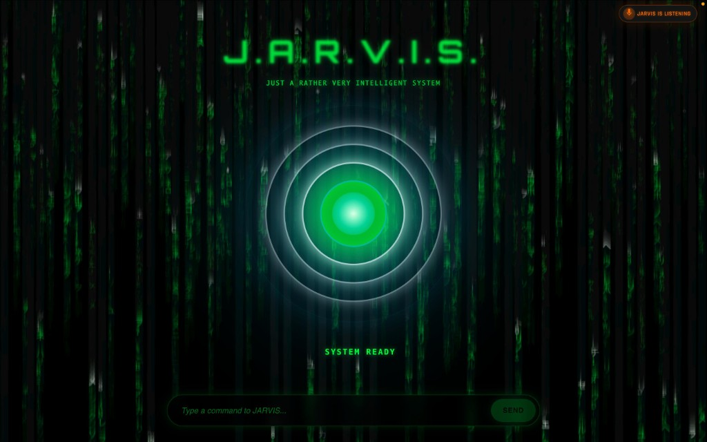

 

---

For the past 12 months, I have been executing a solo build of **JARVIS** — a three-repository, multi-process autonomous AI operating system spanning Python, C++, Rust, Go, Swift, Objective-C, and TypeScript. The system orchestrates 60+ asynchronous agents across a neural mesh, routes inference dynamically between local Apple Silicon and GCP, performs real-time voice biometric authentication, controls macOS at the native API level, and continuously trains its own models through a self-improving feedback loop.

---

###  &nbsp; Now Vibing

  

<b>DS4EVER</b> &nbsp;·&nbsp; Click to listen on Spotify

---

##  Currently Building

---

##  Tech Stack

#### Languages

#### ML, Inference and Data

#### Infrastructure and Cloud

#### Backend and Frontend

<b>Full Stack Inventory (text)</b>

 

| Category | Technologies |
|----------|-------------|
| **Languages** | Python, C, C++, Rust, Go, Swift, Objective-C, Objective-C++, TypeScript, JavaScript, SQL, Shell/Bash, ARM64 Assembly (NEON SIMD), Metal Shading Language, AppleScript, Protobuf, HCL/Terraform, CUDA, HTML/CSS |
| **ML / Inference** | PyTorch, Transformers, llama.cpp, llama-cpp-python, GGUF quantization, ONNX Runtime, CoreML Tools, SpeechBrain, scikit-learn, SentenceTransformers, HuggingFace Hub, safetensors, tiktoken, Numba (JIT), sympy, LangChain, YOLO |
| **Training** | LoRA, DPO, RLHF, FSDP, MAML (meta-learning), curriculum learning, federated learning, causal reasoning, world model training, online learning, active learning, EWC |
| **Models / Vision** | LLaVA (multimodal), ECAPA-TDNN (speaker verification), Whisper (faster-whisper, openai-whisper), Porcupine/Picovoice (wake word), Piper TTS, OmniParser (OCR) |
| **LLM APIs** | Anthropic Claude API (chat, vision, computer use), OpenAI API (chat completions, embeddings), Google Gemini API, Ollama (local inference) |
| **Rust** | PyO3, ndarray, rayon, parking_lot, DashMap, crossbeam, serde, mimalloc, image crate, Metal (GPU compute), tokio, zstd, lz4, candle (on-device ML) |
| **Swift / macOS** | Swift Package Manager, CoreLocation, WeatherKit, AppKit, Foundation, Quartz/CoreGraphics, Accessibility API, AVFoundation, pyobjc, launchd, osascript, yabai |
| **Vector / Data** | ChromaDB, FAISS, Redis, PostgreSQL (asyncpg, psycopg2), SQLite (aiosqlite), NetworkX, bloom filters |
| **Infrastructure** | GCP (Compute Engine, Cloud SQL, Cloud Run, Secret Manager, Monitoring), Docker, docker-compose, Terraform, Kubernetes, systemd, CMake, pybind11, cpp-httplib |
| **CI/CD** | GitHub Actions (30+ workflows), CodeQL, Super-Linter, Dependabot, Gitleaks, Postman/Newman, git worktrees |
| **Backend** | FastAPI, uvicorn, uvloop, gRPC, Protobuf, asyncio, aiohttp, httpx, WebSocket, Cloud SQL Proxy, circuit breakers, exponential backoff, distributed locks, epoch fencing |
| **Observability** | OpenTelemetry (tracing + metrics + OTLP/gRPC export), Prometheus, structlog, psutil, Pydantic, JSONL telemetry pipeline, LangFuse, Helicone, PostHog |
| **Frontend** | React 19, Next.js, Framer Motion, Axios, WebSocket real-time streaming |
| **Audio / Vision** | OpenCV, sounddevice, PyAudio, webrtcvad (VAD), Silero VAD, speexdsp (AEC), librosa, pyautogui, CoreML VAD, Tesseract OCR |
| **Voice / TTS** | ElevenLabs, GCP TTS, Piper TTS, Edge-TTS, gTTS, pyttsx3, macOS Say, Wav2Vec2 |
| **C++ (ReactorCore)** | Custom `mlforge` ML library: KD-trees, graph structures, trie, matrix ops, linear/logistic regression, decision trees, neural nets, model serialization, deployment API |
| **AI Orchestration** | LangChain, LangGraph, CrewAI, OpenHands, Open Interpreter, OmniParser |
| **Experiment Tracking** | Weights & Biases (wandb), TensorBoard |
| **Browser Automation** | Playwright, DuckDuckGo Search, Beautiful Soup |
| **Quality / Linting** | pytest, Ruff, Black, isort, Flake8, mypy, Pyright, Bandit, ESLint, pre-commit |
| **Notifications** | Discord, Slack, Telegram, SMTP/Email |
| **External APIs** | OpenWeather, Alpha Vantage, News API, Wikipedia API, Google Safe Browsing |

---

##  AI Tools & Development

<b>Full AI & Dev Tools Inventory</b>

 

| Category | Tools |
|----------|-------|
| **LLM Platforms** | Anthropic Claude (chat, vision, computer use), OpenAI (Whisper, embeddings), Google Gemini, Ollama, HuggingFace Transformers, llama.cpp (GGUF), Apple MLX, Candle (Rust ML), ONNX Runtime, CoreML |
| **AI Development** | Cursor IDE, Claude Code CLI, Claude GitHub Actions (5 workflows: PR analyzer, docs generator, test generator, security analyzer, auto-fix) |
| **AI Orchestration** | LangChain, LangGraph, CrewAI (multi-agent), OpenHands (coding assistant), Open Interpreter, OmniParser (vision parsing) |
| **Experiment Tracking** | Weights & Biases (wandb), TensorBoard, LangFuse (LLM observability), Helicone (LLM cost tracking), PostHog (product analytics) |
| **Voice & Audio** | OpenAI Whisper, Faster-Whisper, SpeechBrain, Wav2Vec2, ElevenLabs TTS, GCP TTS, Piper TTS, Edge-TTS, gTTS, pyttsx3, Picovoice/Porcupine (wake word), WebRTC VAD, Silero VAD, CoreML VAD |
| **Browser Automation** | Playwright, DuckDuckGo Search, Beautiful Soup, Google Safe Browsing API |
| **Testing & Quality** | pytest, Ruff, Black, isort, Flake8, mypy, Pyright, Bandit, ESLint, Super-Linter, CodeQL, Dependabot, Gitleaks, Postman/Newman, pre-commit hooks |
| **Notifications** | Discord, Slack, Telegram, SMTP/Email (Gmail) |
| **External Data APIs** | OpenWeather, Alpha Vantage (stocks), News API, Wikipedia API, Google NotebookLM |

---

##  Demo

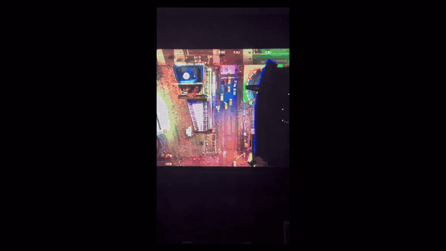

  

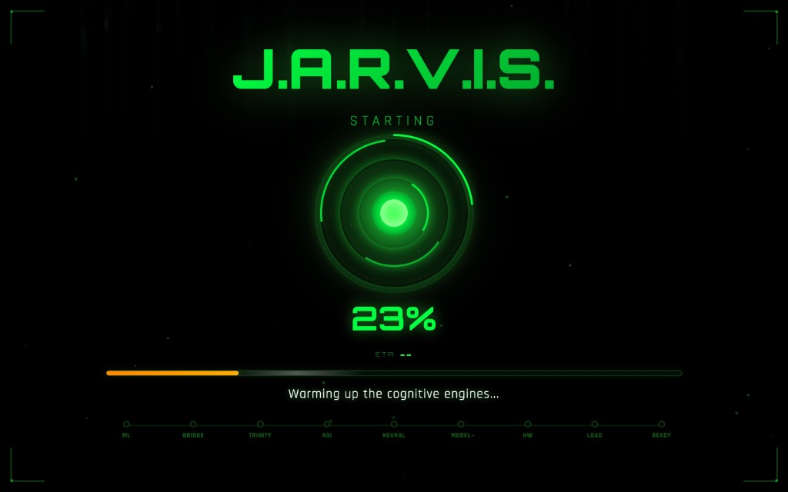

 
<b>JARVIS Boot Sequence Interface</b> &nbsp;·&nbsp; System startup telemetry and cognitive engine warmup state

  

---

##  Data Structures & Algorithms

Every component below is production code running in the JARVIS ecosystem — not academic exercises.

<b>Data Structures (50+ types)</b>

 

| Category | Structures | Implementation |
|----------|-----------|----------------|
| **Trees** | Quadtree (spatial indexing), KD-Tree (nearest neighbor + radius search), Trie (prefix search), DAG (startup dependency graph), Scene Graph, Knowledge Graph, Process Tree | Python + Rust + C++ |
| **Graphs** | Reasoning Graph, Dependency Graph, Multi-Space Context Graph, Window Relationship Graph, Service Mesh Discovery Graph, LangGraph state machines, Causal Graphs (do-calculus) | Python |
| **Hash-Based** | Bloom Filters (3 languages), LSH Semantic Cache, LRU Cache, TTL Cache, Consistent Hashing, DashMap (lock-free concurrent), Bitmaps/Bitsets | Python + Rust + Swift |
| **Heaps & Queues** | Binary Heap (heapq), Priority Queue, Bounded Queue, Ring Buffer, Circular Buffer, Work-Stealing Queue, Zero-Copy IPC (mmap), Lock-Free SPSC Queue | Python + Rust + JS |
| **Concurrent** | Arc\<Mutex\<>>, RwLock, DashMap, mpsc channels, Vector Clock, CRDT, Distributed Lock, asyncio.Queue | Rust + Python |
| **Matrices & Tensors** | Matrix2D, Matrix3D (row-major), Sparse Matrices (nalgebra-sparse), PyTorch Tensors, Quantized Tensors (INT8/INT4), Embedding Vectors | Rust + C++ + Python |
| **Memory** | Memory Pool, Slab Allocator, Zero-Copy Buffers, Object Recycler, mmap Ring Buffers | Rust + Python |
| **State** | Finite State Machine, Event Bus, Event Store, Sliding Window, Bounded Collections | Python |

<b>Algorithms (80+ implementations)</b>

 

| Category | Algorithms | Where |
|----------|-----------|-------|
| **Resilience** | Circuit Breaker (5 variants), Exponential Backoff w/ Jitter, Graceful Degradation, Self-Healing, Leader Election, Distributed Locking, Distributed Transactions, Distributed Dedup | JARVIS + Prime |
| **Scheduling** | Round Robin, Token Bucket, Leaky Bucket, Sliding Window Rate Limiter, Work Stealing, Backpressure Control, Adaptive ML-Based Rate Limiting | All three repos |
| **Graph / Search** | Topological Sort (DAG), BFS/DFS, A\* Search, Dijkstra's Shortest Path, K-Nearest Neighbor, PageRank (file importance ranking) | All three repos |
| **Statistical / Bayesian** | Bayesian Inference (Beta-Bernoulli, Normal-Normal posteriors), Bayesian Confidence Fusion, Multi-Armed Bandit (Thompson Sampling, epsilon-greedy), Monte Carlo Validation, Kalman Filter (RSSI smoothing), Markov Chain Prediction | JARVIS + Prime |
| **ML Training** | LoRA/QLoRA, DPO (preference optimization), RLHF (PPO pipeline), FSDP (parameter sharding), MAML/Reptile (meta-learning), Federated Learning (FedAvg, FedProx, Byzantine-robust), Curriculum Learning, Causal Reasoning (do-calculus), Online Learning w/ EWC, World Model Training (Dreamer/MuZero-inspired), Knowledge Distillation (Hinton, FitNets, attention transfer, multi-teacher), Gradient Accumulation, Mixed Precision (BF16/FP16) | ReactorCore + Prime |
| **ML Inference** | Quantized INT8/INT4, Cosine Similarity, LSH, Vector Search, Anomaly Detection, Pattern Recognition, Goal Inference, Activity Recognition, Tiered Complexity Routing, Flash Attention | JARVIS + Prime |
| **Neural Networks** | Multi-Head Self-Attention, Dropout, BatchNorm, LayerNorm, LSTM + Attention, Feedforward w/ Backpropagation, Cognitive Layers (cross-attention + residual) | All three repos |
| **Clustering & Reduction** | K-Means, DBSCAN, PCA, Truncated SVD, TF-IDF Vectorization | JARVIS + Reactor |
| **Ensemble Methods** | Random Forest, Gradient Boosting, Isolation Forest, Ensemble STT (multi-model voting), Weighted Model Ensemble (majority/cascade) | JARVIS + Reactor |
| **Signal Processing** | VAD (WebRTC + Silero + CoreML), MFCC/Mel Filterbanks, Spectrogram, Anti-Spoofing, Barge-In Detection, ECAPA-TDNN Speaker Verification | JARVIS |
| **Compression** | Zstd, LZ4, Gzip/Zlib, Custom Vision Compression | Rust + Python |
| **Cryptography** | HMAC, SHA-256, MD5, JWT, Secure Password Hashing, File Integrity Checksums, Checkpoint Verification | All three repos |
| **Caching** | LRU Eviction, TTL Eviction, Predictive Cache Warming (EWMA + time-series), LSH Semantic Cache, Bloom Filter Negative Cache, Memoization (lru_cache) | All three repos |
| **Evolutionary** | Genetic Algorithm (Ouroboros self-programming loop) | JARVIS |
| **Concurrency** | Deadlock Prevention, CPU Affinity Pinning, Parallel DAG Initialization, Zero-Copy mmap IPC, Lock-Free Channels | JARVIS + Prime |
| **GPU / SIMD** | Metal Compute Shaders, ARM64 NEON SIMD Intrinsics | JARVIS (Rust + C + Assembly) |
| **C++ ML (mlforge)** | Linear Regression (Ridge/Lasso), Logistic Regression, Decision Tree (Gini), Neural Net (backprop), Matrix Serialization, KD-Tree, Graph (BFS/DFS), Trie | ReactorCore |

---

##  GitHub Stats

 

 

 

<a href="https://github.com/drussell23">
  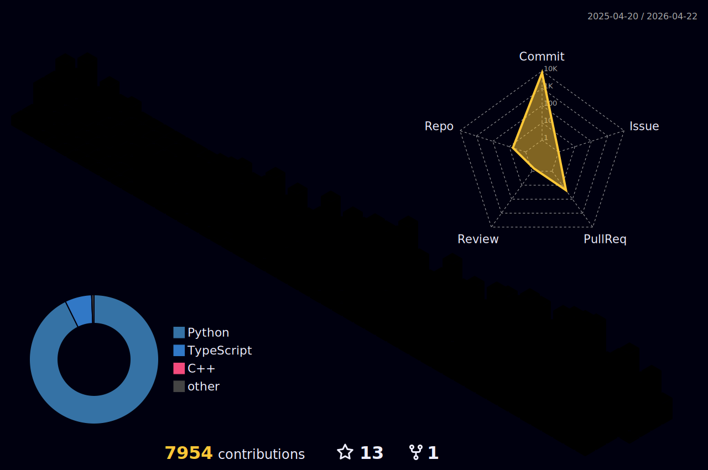
</a>

<picture>
  <source media="(prefers-color-scheme: dark)" srcset="https://raw.githubusercontent.com/drussell23/drussell23/output/github-snake-dark.svg" />
  <source media="(prefers-color-scheme: light)" srcset="https://raw.githubusercontent.com/drussell23/drussell23/output/github-snake.svg" />
  
</picture>

---

##  Metrics Dashboard

<a href="https://github.com/drussell23">
  
</a>

---

##  The JARVIS Ecosystem

JARVIS is not a chatbot wrapper. It is a distributed AI operating system composed of three interdependent repositories — each a standalone production system, together forming a self-improving autonomous intelligence.

### System Architecture

<b>Purpose, Problem, Challenge, Solution</b>

 

- **Purpose:** Define the three-system operating model (`JARVIS`, `JARVIS-Prime`, `ReactorCore`) under one unified kernel.
- **Problem:** Most AI systems stop at a single model endpoint and fail at end-to-end autonomy, coordination, and lifecycle management.
- **Core Challenge:** Keep orchestration, inference, and training decoupled enough to scale independently while still behaving like one product.
- **What This Solves:** Creates a durable systems contract: `JARVIS` runs operations, `Prime` serves intelligence, `Reactor` continuously improves intelligence.

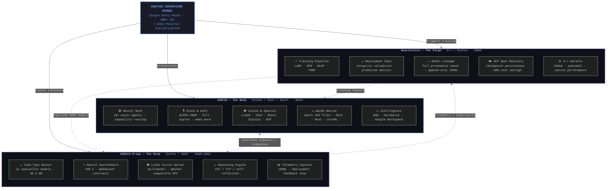

### Data Flow

<b>Purpose, Problem, Challenge, Solution</b>

 

- **Purpose:** Show the runtime request path from multimodal inputs to routed inference and back to user-visible action.
- **Problem:** Input streams (voice, screen, command) are heterogeneous and require different model strategies and latencies.
- **Core Challenge:** Route by task type in real time while capturing high-quality telemetry for future model improvement.
- **What This Solves:** Demonstrates a closed execution path where each response both serves the user now and improves the system later.

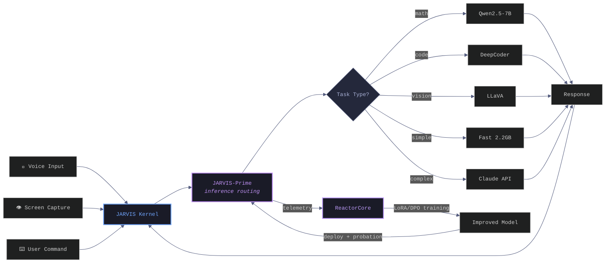

### Three-Tier Inference Routing

<b>Purpose, Problem, Challenge, Solution</b>

 

- **Purpose:** Define a deterministic fallback ladder for reliability under changing infrastructure and hardware conditions.
- **Problem:** A single inference backend is a single point of failure (downtime, cold starts, local resource pressure, API outages).
- **Core Challenge:** Preserve quality and uptime while controlling cost and avoiding hard dependency on any one execution tier.
- **What This Solves:** Guarantees service continuity through policy-based failover: `GCP` -> `Local Metal` -> `Claude API`.

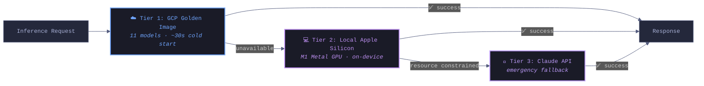

### GCP Hybrid Cloud Spot Architecture

<b>Purpose, Problem, Challenge, Solution</b>

 

- **Purpose:** Run high-throughput inference and training on GCP while preserving local fallback and cost control.
- **Problem:** On-demand cloud is expensive at scale, while local-only inference cannot absorb peak load or large-model demand.
- **Core Challenge:** Balance latency, uptime, and spend when Spot VMs can be preempted without warning.
- **What This Solves:** Introduces hybrid execution with preemption-aware orchestration, checkpoint recovery, and automatic failover to local/API tiers.

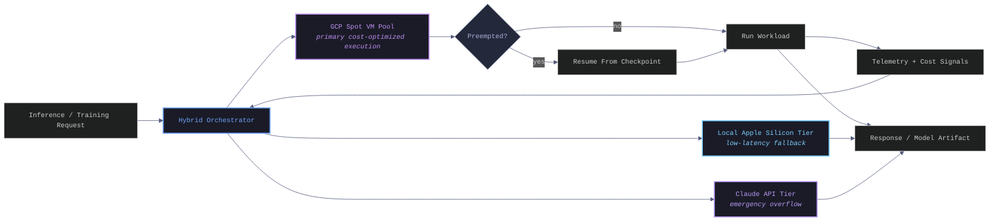

### Golden Image Architecture (Model-Ready Compute)

<b>Purpose, Problem, Challenge, Solution</b>

 

- **Purpose:** Eliminate repeated cold setup by pre-baking model runtimes and dependencies into immutable machine images.
- **Problem:** Dynamic provisioning causes long startup times, dependency drift, and inconsistent behavior across nodes.
- **Core Challenge:** Keep images reproducible and secure while continuously shipping model/runtime updates.
- **What This Solves:** Establishes an immutable golden-image pipeline with validation gates and rollout controls for consistent low-latency boot.

```mermaid
%%{init: {'theme': 'dark', 'themeVariables': { 'primaryColor': '#1a1b27', 'primaryTextColor': '#a9b1d6', 'lineColor': '#545c7e', 'fontSize': '13px', 'fontFamily': 'JetBrains Mono, monospace' }}}%%

flowchart LR
    SRC["Model + Runtime Source"] --> BUILD["Image Builder Pipeline"]
    BUILD --> BAKE["Bake Golden Image<br/><i>models + deps + startup contracts</i>"]
    BAKE --> VALIDATE["Validation Gate<br/><i>health, integrity, startup SLA</i>"]
    VALIDATE -->|"pass"| REG["Image Registry"]
    VALIDATE -->|"fail"| REJECT["Reject Build"]

    REG --> SCALE["Autoscaled GCP Inference Nodes"]
    SCALE --> PRIME["JARVIS-Prime Router"]
    PRIME --> MON["Observability + Drift Monitoring"]
    MON --> BUILD

    style BUILD fill:#1a1b27,stroke:#70a5fd,stroke-width:2px,color:#70a5fd
    style BAKE fill:#1a1b27,stroke:#bf91f3,stroke-width:2px,color:#bf91f3
    style VALIDATE fill:#1a1b27,stroke:#7dcfff,stroke-width:2px,color:#7dcfff
    style REG fill:#1a1b27,stroke:#bb9af7,stroke-width:2px,color:#bb9af7
    style REJECT fill:#1a1b27,stroke:#f7768e,stroke-width:2px,color:#f7768e
```

### Execution Planes (Control / Data / Model)

<b>Purpose, Problem, Challenge, Solution</b>

 

- **Purpose:** Separate operational concerns into control, data, and model planes for clearer ownership and safer evolution.
- **Problem:** Without plane separation, policy, state, and model behavior become tightly coupled and brittle during scale-out.
- **Core Challenge:** Enforce governance and safety globally while allowing model and data pipelines to move quickly.
- **What This Solves:** Makes architecture auditable and composable: control governs, data persists context, models execute decisions.

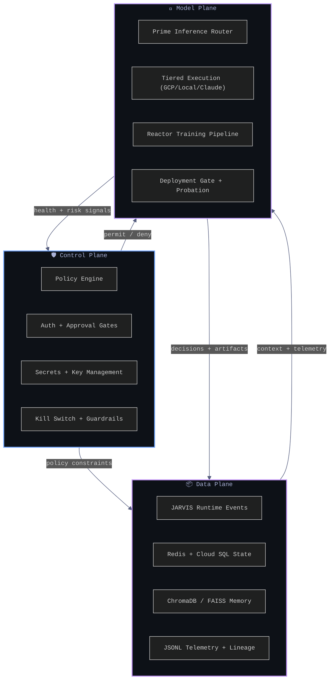

### Safety & Governance Path

<b>Purpose, Problem, Challenge, Solution</b>

 

- **Purpose:** Document the decision policy from risk classification to approval, execution, blocking, and audit.
- **Problem:** Autonomous systems can perform high-impact actions where incorrect execution is costly or irreversible.
- **Core Challenge:** Balance autonomy and velocity with explicit human control boundaries for high-risk operations.
- **What This Solves:** Provides a predictable safety envelope: low-risk auto-exec, medium-risk constrained mode, high-risk human-in-the-loop.

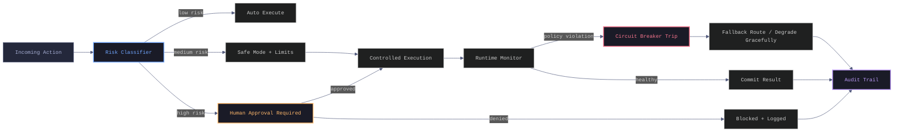

### Observability & Closed-Loop Learning

<b>Purpose, Problem, Challenge, Solution</b>

 

- **Purpose:** Show how runtime signals become training data, deployment decisions, and measurable model upgrades.
- **Problem:** Teams often collect telemetry but fail to operationalize it into safe, repeatable improvement cycles.
- **Core Challenge:** Detect regressions early, gate bad models, and continuously retrain without destabilizing production.
- **What This Solves:** Establishes a true learning loop: observe -> detect -> curate -> train -> gate/probation -> deploy or rollback.

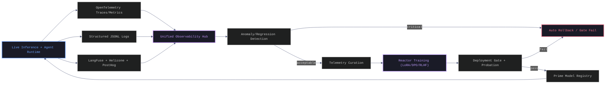

---

### Repository Breakdown

<table>
<tr>
<td align="center" width="33%">

  

  
<b>Port 8010</b> 
60+ Agent Neural Mesh 
Voice Biometrics 
Ghost Display + Vision 
macOS Native (203 Swift files) 
RAG + Ouroboros Self-Programming

</td>
<td align="center" width="33%">

  

  
<b>Port 8000-8001</b> 
11 Specialist GGUF Models (40.4 GB) 
Task-Type Inference Routing 
LLaVA Vision Server 
CoT/ToT Reasoning Engine 
Neural Switchboard v98.1

</td>
<td align="center" width="33%">

  

  
<b>Port 8090</b> 
LoRA / DPO / RLHF Training 
Deployment Gate + Probation 
Model Lineage Tracking 
GCP Spot VM Auto-Recovery 
Native C++ Training Kernels

</td>
</tr>
</table>

---

###  &nbsp; Deep Dive

<b>Agent Architecture</b>

 

- **Neural Mesh** — 16+ specialized agents (activity recognition, adaptive resource governor, context tracker, error analyzer, goal inference, Google Workspace, health monitor, memory, pattern recognition, predictive planning, spatial awareness, visual monitor, web search, coordinator) with asynchronous message passing, capability-based routing, and cross-agent data flow
- **Autonomous Agent Runtime** — multi-step goal decomposition, agentic task execution, tool orchestration, error recovery, and intervention decision engine with human-in-the-loop approval for destructive actions
- **AGI OS Coordinator** — proactive event stream, notification bridge, owner identity service, voice approval manager, and intelligent startup announcer

<b>Voice and Authentication</b>

 

- **Real-time voice biometric authentication** via ECAPA-TDNN speaker verification with cloud/local hybrid inference and multi-factor fusion (voice + proximity + behavioral)
- **Real-time voice conversation** — full-duplex audio (simultaneous mic + speaker), acoustic echo cancellation (speexdsp), streaming STT (faster-whisper), adaptive turn detection, barge-in control, and sliding 20-turn context window
- **Wake word detection** (Porcupine/Picovoice), Apple Watch Bluetooth proximity auth, continuous learning voice profiles
- **Unified speech state management** — STT hallucination guard, voice pipeline orchestration, parallel model loading

<b>Vision and Spatial Intelligence</b>

 

- **Never-skip screen capture** — two-phase monitoring (always-capture + conditional-analysis), self-hosted LLaVA multimodal analysis, Claude Vision escalation
- **Ghost Display** — virtual macOS display for non-intrusive background automation, Ghost Hands orchestrator for autonomous visual workflows
- **Claude Computer Use** — automated mouse, keyboard, and screenshot interaction via Anthropic's Computer Use API
- **OCR / OmniParser** — screen text extraction, window analysis, workspace name detection, multi-monitor and multi-space intelligence via yabai window manager
- **YOLO + Claude hybrid vision** — object detection with LLM-powered semantic understanding
- **Rust vision core** — native performance for fast image processing, bloom filter networks, and sliding window analysis

<b>macOS Native Integration (Swift / Objective-C / Rust)</b>

 

- **Swift bridge** (203 files) — CommandClassifier, SystemControl (preferences, security, clipboard, filesystem), PerformanceCore, ScreenCapture, WeatherKit, CoreLocation GPS
- **Objective-C voice unlock daemon** — JARVISVoiceAuthenticator, JARVISVoiceMonitor, permission manager, launchd service integration
- **Rust performance layer** — PyO3 bindings for memory pool management, quantized ML inference, vision fast processor, command classifier, health predictor; ARM64 SIMD assembly optimizations
- **CoreML acceleration** — on-device intent classification, voice processing

<b>Infrastructure and Reliability</b>

 

- **Parallel initializer** with cooperative cancellation, adaptive EMA-based deadlines, dependency propagation, and atomic state persistence
- **CPU-pressure-aware cloud shifting** — automatic workload offload to GCP when local resources are constrained
- **Enterprise hardening** — dependency injection container, enterprise process manager, system hardening, governance, Cloud SQL with race-condition-proof proxy management, TLS-safe connection factories, distributed lock manager
- **Three-tier inference routing**: GCP Golden Image (primary) → Local Apple Silicon (fallback) → Claude API (emergency)
- **Trinity event bus** — cross-repo IPC hub, heartbeat publishing, knowledge graph, state management, process coordination
- **Cost tracking and rate limiting** — GCP cost optimization with Bayesian confidence fusion, intelligent rate orchestration
- **File integrity guardian** — pre-commit integrity verification across the codebase

<b>Intelligence and Learning</b>

 

- **Google Workspace Agent** — Gmail read/search/draft, Google Calendar, natural language intent routing via tiered command router
- **Proactive intelligence** — predictive suggestions, proactive vision monitoring, proactive communication, emotional intelligence module
- **RAG pipeline** — ChromaDB vector store, FAISS similarity search, embedding service, long-term memory system
- **Chain-of-thought / reasoning graph engine** — LangGraph-based multi-step reasoning with conditional routing and reflection loops
- **Ouroboros** — self-programming engine for autonomous codebase analysis and improvement
- **Web research service** — autonomous web search and information synthesis
- **A/B testing framework** — vision pipeline experimentation
- **Repository intelligence** — code ownership analysis, dependency analyzer, API contract analyzer, AST transformer, cross-repo refactoring engine

###  &nbsp; Deep Dive

<b>Inference and Routing</b>

 

- **11 specialist GGUF models** (~40.4 GB) pre-baked into a GCP golden image with ~30-second cold starts
- **Task-type routing** — math queries hit Qwen2.5-7B, code queries hit DeepCoder, simple queries hit a 2.2 GB fast model, vision hits LLaVA
- **GCP Model Swap Coordinator** with intelligent hot-swapping, per-model configuration, and inference validation
- **Neural Switchboard v98.1** — stable public API facade over routing and orchestration with WebSocket integration contracts
- **Hollow Client mode** for memory-constrained hardware — strict lazy imports, zero ML dependencies at startup on 16 GB machines

<b>Reasoning and Telemetry</b>

 

- **Continuous learning hook** — post-inference experience recording for Elastic Weight Consolidation via ReactorCore
- **Reasoning engine activation** — chain-of-thought scaffolding (CoT/ToT/self-reflection) for high-complexity requests above configurable thresholds
- **APARS protocol** (Adaptive Progress-Aware Readiness System) — 6-phase startup with real-time health reporting to the supervisor
- **LLaVA vision server** — multimodal inference on port 8001 with OpenAI-compatible API, semaphore serialization, queue depth cap
- **Telemetry capture** — structured JSONL interaction logging with deployment feedback loop and post-deployment probation monitoring

###  &nbsp; Deep Dive

<b>Training Pipeline</b>

 

- **Full training pipeline**: telemetry ingestion → active learning selection → gatekeeper evaluation → LoRA SFT → GGUF export → deployment gate → probation monitoring → feedback loop
- **DeploymentGate** validates model integrity before deployment; rejects corrupt or degenerate outputs
- **Post-deployment probation** — 30-minute health monitoring window with automatic commit or rollback based on live inference quality
- **Model lineage tracking** — full provenance chain (hash, parent model, training method, evaluation scores, gate decision) in append-only JSONL
- **Tier-2/Tier-3 runtime orchestration** — curriculum learning, meta-learning (MAML), causal discovery with correlation-based fallback, world model training

<b>Infrastructure and Integration</b>

 

- **GCP Spot VM auto-recovery** with training checkpoint persistence and 60% cost reduction over on-demand instances
- **Native C++ training kernels** via CMake/pybind11/cpp-httplib for performance-critical operations
- **Atomic experience snapshots** — buffer drain under async lock, JSONL with DataHash for dataset versioning
- **PrimeConnector** — WebSocket path rotation, health polling fallback, contract path discovery for cross-repo communication
- **Cross-repo integration** — Ghost Display state reader, cloud mode detection, Trinity Unified Loop Manager, pipeline event logger with correlation IDs

---

## Technical Footprint

| Metric | Value |
|--------|-------|
| **Total commits** | 3,900+ across 3 repositories |
| **Codebase** | ~2.5 million lines across 18+ languages |
| **Build duration** | 12 months, solo |
| **Unified kernel** | 50,000+ lines in a single orchestration file |
| **Neural Mesh agents** | 16+ specialized agents with async message passing |
| **Models served** | 11 specialist GGUF models via task-type routing |
| **Inference tiers** | GCP Golden Image → Local Metal GPU → Claude API |
| **Training pipeline** | Automated: telemetry → active learning → gatekeeper → training → GGUF export → deployment gate → probation → feedback |
| **Voice auth** | Multi-factor: ECAPA-TDNN biometric + Apple Watch proximity + behavioral analysis |
| **Vision pipeline** | Never-skip capture, LLaVA self-hosted, Claude escalation, YOLO hybrid, OCR/OmniParser |
| **Swift components** | 203 files — system control, command classifier, screen capture, GPS, weather |
| **Rust crates** | 5 Cargo workspaces — memory pool, vision processor, ML inference, SIMD optimizations |
| **Terraform modules** | 7 modules (compute, network, security, storage, monitoring, budget, Spot templates) |
| **Dockerfiles** | 6 (backend, backend-slim, frontend, training, cloud, GCP inference) |
| **GitHub Actions** | 20+ workflows (CI/CD, CodeQL, e2e testing, deployment, database validation, file integrity) |
| **macOS integration** | Native Swift/ObjC daemons, yabai WM, Ghost Display, multi-space/multi-monitor, launchd services |
| **Cloud infrastructure** | GCP (Compute Engine, Cloud SQL, Cloud Run, Secret Manager, Monitoring), Spot VM auto-recovery |
| **Google Workspace** | Gmail read/search/draft, Calendar, natural language routing via tiered command router |

---

## Background

I graduated from Cal Poly San Luis Obispo with a B.S. in Computer Engineering after a [10-year non-traditional academic path](https://mustangnews.net/10-years-in-the-making-one-cal-poly-students-unique-path-to-an-engineering-degree/) that started in remedial algebra at community college. I retook courses, studied through the loss of family, and spent most of my twenties earning a degree that others finish in four years. The path was not conventional. The outcome was.

JARVIS is what happens when that level of persistence meets engineering capability. Twelve months of daily commits, architectural decisions at every layer of the stack, and a refusal to ship anything that is not production-grade.

---

