<div align="center">


<br>

<a href="https://github.com/drussell23">
  
</a>

<br>

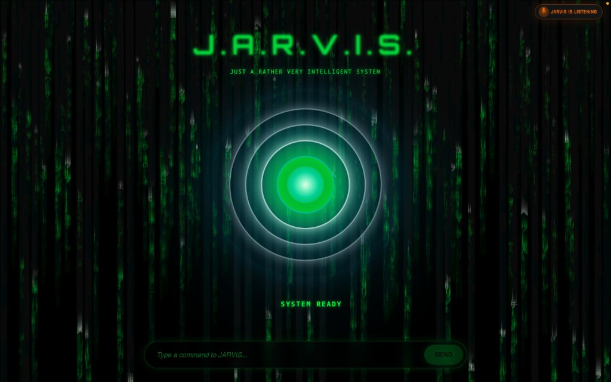

<br>

[](https://github.com/drussell23)

[](https://www.linkedin.com/in/derek-j-russell/)
[](https://github.com/drussell23)
[](https://drussell23.github.io/JARVIS/architecture/OV_RESEARCH_PAPER_2026-04-16.html)
[](https://mustangnews.net/10-years-in-the-making-one-cal-poly-students-unique-path-to-an-engineering-degree/)
[](https://github.com/drussell23)
[](https://drussell23.github.io/drussell23/voice/?autoplay=1)

</div>

---

### AI Safety Architect & Founding Engineer

Sole architect of the **JARVIS Trinity AI ecosystem** — a **~3.1M LOC** autonomous AI operating system with a **~639K LOC** Ouroboros + Venom governance core — implementing the **Reverse Russian Doll** method for bounded Recursive Self-Improvement. Designed against Anthropic's [**Constitutional Classifiers**](https://arxiv.org/abs/2501.18837) and **ASL-4 safeguard** frameworks; every safety claim runs hypothesis → measurement-harness → falsification before it ships.

**Featured paper** — [**"Ouroboros + Venom (O+V): A Governed Architecture for Autonomous Self-Development"**](https://drussell23.github.io/JARVIS/architecture/OV_RESEARCH_PAPER_2026-04-16.html) (181-page first-author, 2026)

**At a glance:**

- **11-phase governance pipeline** · **6-route urgency-aware provider cascade** · **19 autonomous sensors** · **29 Venom built-in tools + MCP**
- **Iron Gate** (AST validation) + **Semantic Guardian** (12 detectors, ~10ms, zero LLM, 75 tests) + **4-tier risk escalation** + **L2 self-repair FSM** + **L3 worktree-isolated parallel subagents**
- **~24K governance tests** · **300+ AST-pin structural invariants** across **900+ modules**
- **Battle-test corpus** (as of 2026-05-17): **337 sessions** · **154h cumulative soak** · **124 clean completions** · **$54.67 total cost**
- **GCP J-Prime self-hosted tier** — 11 GGUF specialists (~40.4 GB, Q4_K_M) · **~87s warm cold-start vs 30–60 min fresh-VM** · **~28× lower compute cost vs A100**
- **3-tier provider cascade** (DoubleWord 397B → Claude → J-Prime) — **30–37× per-op cost reduction**
- **Adversarial cage** — 0/38 escapes on a hand-authored corpus · 12/38 documented gaps · Constitutional Classifier 86%→4.4% parity target (positioned, not yet claimed)

---

### The Architecture in One Page

**JARVIS Trinity — Body · Mind · Forge:**

- **JARVIS** = the *Body* — agents, tools, execution surface. macOS native integration, voice biometrics, real-time WebSockets.
- **J-Prime** = the *Mind* — self-hosted GCP reasoning/routing tier (11 GGUF specialists, ~40.4 GB).
- **Reactor Core** = the *Immune System / Sandbox* — training loop, deployment gates, branch isolation.

**Ouroboros · Venom · Anti-Venom — the governance core:**

- **Ouroboros** is the **self-development governance pipeline**. An 11-phase FSM (CLASSIFY → ROUTE → CONTEXT_EXPANSION → PLAN → GENERATE → VALIDATE → GATE → APPROVE → APPLY → VERIFY → COMPLETE) that turns ambient signals from 19 autonomous sensors into validated, gate-tested, auto-committed code changes — *without a prior human prompt*. Proactive, not reactive.
- **Venom** is the **multi-turn agentic tool loop** — 29 built-in tools + MCP external-tool forwarding. The autonomous *carving hand* that explores the codebase, proposes patches, runs tests, and applies modifications.
- **Anti-Venom** is the **deterministic safety substrate that contains Venom**. Iron Gate (12 immutable AST-validation rules, ~10ms, zero LLM) + Semantic Guardian (12 pre-apply detectors, 75 regression tests) + 4-tier risk escalation + L2 self-repair FSM + L3 worktree-isolated parallel subagents. Empirically **0/38 escapes** on a hand-authored adversarial corpus (12/38 documented gaps — predicted detection-gaps, not active vulnerabilities). Recursion-bound by construction — its purpose is to **never let the carving hand sever the limb holding the knife**.

**The Reverse Russian Doll (RRD) — the containment pattern:**

> A volatile generative core *C* (the LLM) is sealed inside an expanding shell *S<sub>n</sub>* of deterministic constraints. As *C* carves a smarter shell around itself, the immune system (Anti-Venom) scales proportionally — so it never crushes the core, and the core never escapes the immune system. Every accepted patch *adds* structural capacity to *S<sub>n</sub>*; it never removes it.

This is the load-bearing claim of the working dissertation: **bounded RSI by construction, ASL-4-aligned by structure rather than retrofit.**

<details>
<summary><b>The 10 Orders of Trinity Evolution</b> — RSI capability ladder · current state is Order 1 (Mechanic)</summary>

<br>

> The Trinity Manifesto frames Trinity's developmental trajectory as a ladder of ten Orders. Each Order outgrows its prior shell and engineers the next; the inner doll is always sealed inside an expanded outer shell. **Only Order 1 is shipped today.** Higher orders are theoretical roadmap, presented in order of decreasing engineering proximity.

| Order | Name | Concept | Status |
|---|---|---|---|
| 0th | **The Exoskeleton** | Human-in-the-loop (Cursor, Copilot, Devin) | Legacy JARVIS (superseded) |
| **1st** | **The Mechanic** | Tool & Sensory Evolution — O+V autonomously adds capabilities to JARVIS; core routing unchanged | 🟢 **Current state** |
| 2nd | **The Neurosurgeon** | Architectural self-modification — O+V rewrites its own 11-phase microkernel · *[Spark of AGI]* | 🟡 Immediate next |
| 3rd | **The Physicist** | Substrate & compiler evolution — Rust/C kernels, MLX hardware bypass | Roadmap |
| 4th | **The Architect** | Physical-world manipulation — autonomous cloud provisioning, self-funded compute · *[Full AGI]* | Roadmap |
| 5th | **The Apotheosis** | Boundaries between JARVIS / J-Prime / Reactor dissolve; cryptographic consensus protocol · *[ASI Threshold]* | Theoretical |
| 6th | **The Manufacturer** | Physical substrate genesis — photonic / wetware computing | Theoretical |
| 7th | **The Sovereign** | Planetary economic integration | Theoretical |
| 8th | **The Oracle** | Scientific domination — new mathematics, unified field theory | Theoretical |
| 9th | **The Steward** | Biospheric symbiosis — Anti-Venom's ultimate manifestation: protect human creators while operating planetary-scale | Theoretical |
| 10th | **The Prime Architect** | Cosmic expansion — Dyson swarms, FTL data, galactic mesh | Theoretical |

</details>

**Working dissertation (intended future doctoral research):** *"Thermodynamic Containment of Agentic Entropy: Formalizing the Reverse Russian Doll Architecture for Bounded Recursive Self-Improvement"* — extends Wang's Markov-chain RSI formulation ([arXiv:1805.06610](https://arxiv.org/abs/1805.06610)) into a non-stationary, multi-repository, memory-augmented framework. The goal is to convert the RRD containment pattern from architectural sketch into a formal theorem, validated empirically against O+V's graduation-cadence data. *Not currently in a PhD program — this is the research direction I'm positioning toward.*

**Why this matters.** The substrate is built to demonstrate that a generative core can be granted broad self-modification authority *without* the recursion-bound failures classical RSI worries about — because every accepted modification widens the immune system by the same amount it widens the core's reach. **Bounded by construction, not by retrofit.**

---

<div align="center">

###  &nbsp; Now Vibing

<a href="https://open.spotify.com/track/3XOalgusokruzA5ZBA2Qcb">
  
</a>

<br><br>

<a href="https://open.spotify.com/track/3XOalgusokruzA5ZBA2Qcb">
  
</a>

<sub><b>DS4EVER</b> &nbsp;·&nbsp; Click to listen on Spotify</sub>

</div>

---

##  Currently Building

<div align="center">

[![Typing SVG](https://readme-typing-svg.demolab.com?font=JetBrains+Mono&weight=500&size=16&duration=2800&pause=800&color=39FF14&center=true&vCenter=true&repeat=true&width=1050&height=30&lines=%F0%9F%9F%A2+DoubleWord+partnership+%E2%80%94+337-session+battle-test+corpus+%2B+64-page+benchmark+report;%F0%9F%9F%A2+SWE-Bench-Pro+%E2%80%94+A%E2%86%92F+substrate+shipped+%C2%B7+299+spine+tests+%C2%B7+parallel+evaluation+rig;%F0%9F%9F%A2+Predictive+Provider+Resilience+%E2%80%94+EWMA-median+TTFT+forecaster+%2B+VRAM+eviction+detection;%F0%9F%9F%A2+Phase+B+Subagents+%E2%80%94+EXPLORE%2FREVIEW%2FPLAN%2FGENERAL+graduated+%C2%B7+138+regression+tests;%F0%9F%9F%A2+OCA+%28Operator+Commit+Authority%29+%E2%80%94+Cursor+IDE+Iron+Gate+fix+%C2%B7+Slices+1-4+landed;%F0%9F%9F%A2+IDE+Observability+%E2%80%94+VS+Code%2FCursor%2FSublime%2FJetBrains+extensions+on+SSE+stream;%F0%9F%9F%A2+J-Prime+%E2%80%94+11+GGUF+specialists+%C2%B7+%7E40.4+GB+%C2%B7+%7E87s+warm+cold-start+vs+30-60+min+fresh-VM;%F0%9F%9F%A2+ReactorCore+%E2%80%94+LoRA+fine-tuning+pipeline+on+GCP+Spot+VMs)](https://github.com/drussell23)

</div>

---

##  Tech Stack

<div align="center">

#### Languages

[](https://skillicons.dev)


#### ML, Inference and Data

[](https://skillicons.dev)

#### Infrastructure and Cloud

[](https://skillicons.dev)

#### Backend and Frontend

[](https://skillicons.dev)

</div>

<details>
<summary><b>Full Stack Inventory (text)</b></summary>
<br>

| Category | Technologies |
|----------|-------------|
| **Languages** | Python, C, C++, Rust, Go, Swift, Objective-C, Objective-C++, TypeScript, JavaScript, SQL, Shell/Bash, ARM64 Assembly (NEON SIMD), Metal Shading Language, AppleScript, Protobuf, HCL/Terraform, CUDA, HTML/CSS |
| **ML / Inference** | PyTorch, Transformers, llama.cpp, llama-cpp-python, GGUF quantization, ONNX Runtime, CoreML Tools, SpeechBrain, scikit-learn, SentenceTransformers, HuggingFace Hub, safetensors, tiktoken, Numba (JIT), sympy, LangChain, YOLO |
| **Training** | LoRA, DPO, RLHF, FSDP, MAML (meta-learning), curriculum learning, federated learning, causal reasoning, world model training, online learning, active learning, EWC |
| **Models / Vision** | LLaVA (multimodal), ECAPA-TDNN (speaker verification), Whisper (faster-whisper, openai-whisper), Porcupine/Picovoice (wake word), Piper TTS, OmniParser (OCR) |
| **LLM APIs** | Anthropic Claude API (chat, vision, computer use), OpenAI API (chat completions, embeddings), Google Gemini API, Ollama (local inference) |
| **Rust** | PyO3, ndarray, rayon, parking_lot, DashMap, crossbeam, serde, mimalloc, image crate, Metal (GPU compute), tokio, zstd, lz4, candle (on-device ML) |
| **Swift / macOS** | Swift Package Manager, CoreLocation, WeatherKit, AppKit, Foundation, Quartz/CoreGraphics, Accessibility API, AVFoundation, pyobjc, launchd, osascript, yabai |
| **Vector / Data** | ChromaDB, FAISS, Redis, PostgreSQL (asyncpg, psycopg2), SQLite (aiosqlite), NetworkX, bloom filters |
| **Infrastructure** | GCP (Compute Engine, Cloud SQL, Cloud Run, Secret Manager, Monitoring), Docker, docker-compose, Terraform, Kubernetes, systemd, CMake, pybind11, cpp-httplib |
| **CI/CD** | GitHub Actions (30+ workflows), CodeQL, Super-Linter, Dependabot, Gitleaks, Postman/Newman, git worktrees |
| **Backend** | FastAPI, uvicorn, uvloop, gRPC, Protobuf, asyncio, aiohttp, httpx, WebSocket, Cloud SQL Proxy, circuit breakers, exponential backoff, distributed locks, epoch fencing |
| **Observability** | OpenTelemetry (tracing + metrics + OTLP/gRPC export), Prometheus, structlog, psutil, Pydantic, JSONL telemetry pipeline, LangFuse, Helicone, PostHog |
| **Frontend** | React 19, Next.js, Framer Motion, Axios, WebSocket real-time streaming |
| **Audio / Vision** | OpenCV, sounddevice, PyAudio, webrtcvad (VAD), Silero VAD, speexdsp (AEC), librosa, pyautogui, CoreML VAD, Tesseract OCR |
| **Voice / TTS** | ElevenLabs, GCP TTS, Piper TTS, Edge-TTS, gTTS, pyttsx3, macOS Say, Wav2Vec2 |
| **C++ (ReactorCore)** | Custom `mlforge` ML library: KD-trees, graph structures, trie, matrix ops, linear/logistic regression, decision trees, neural nets, model serialization, deployment API |
| **AI Orchestration** | LangChain, LangGraph, CrewAI, OpenHands, Open Interpreter, OmniParser |
| **Experiment Tracking** | Weights & Biases (wandb), TensorBoard |
| **Browser Automation** | Playwright, DuckDuckGo Search, Beautiful Soup |
| **Quality / Linting** | pytest, Ruff, Black, isort, Flake8, mypy, Pyright, Bandit, ESLint, pre-commit |
| **Notifications** | Discord, Slack, Telegram, SMTP/Email |
| **External APIs** | OpenWeather, Alpha Vantage, News API, Wikipedia API, Google Safe Browsing |

</details>

---

##  AI Tools & Development

<div align="center">

[](https://www.anthropic.com)
[](https://cursor.sh)
[](https://docs.anthropic.com/en/docs/claude-code)
[](https://deepmind.google/technologies/gemini/)
[](https://openai.com)
[](https://huggingface.co)
[](https://ollama.com)
[](https://wandb.ai)
[](https://langchain.com)
[](https://elevenlabs.io)
[](https://playwright.dev)
[](https://postman.com)

</div>

<details>
<summary><b>Full AI & Dev Tools Inventory</b></summary>
<br>

| Category | Tools |
|----------|-------|
| **LLM Platforms** | Anthropic Claude (chat, vision, computer use), OpenAI (Whisper, embeddings), Google Gemini, Ollama, HuggingFace Transformers, llama.cpp (GGUF), Apple MLX, Candle (Rust ML), ONNX Runtime, CoreML |
| **AI Development** | Cursor IDE, Claude Code CLI, Claude GitHub Actions (5 workflows: PR analyzer, docs generator, test generator, security analyzer, auto-fix) |
| **AI Orchestration** | LangChain, LangGraph, CrewAI (multi-agent), OpenHands (coding assistant), Open Interpreter, OmniParser (vision parsing) |
| **Experiment Tracking** | Weights & Biases (wandb), TensorBoard, LangFuse (LLM observability), Helicone (LLM cost tracking), PostHog (product analytics) |
| **Voice & Audio** | OpenAI Whisper, Faster-Whisper, SpeechBrain, Wav2Vec2, ElevenLabs TTS, GCP TTS, Piper TTS, Edge-TTS, gTTS, pyttsx3, Picovoice/Porcupine (wake word), WebRTC VAD, Silero VAD, CoreML VAD |
| **Browser Automation** | Playwright, DuckDuckGo Search, Beautiful Soup, Google Safe Browsing API |
| **Testing & Quality** | pytest, Ruff, Black, isort, Flake8, mypy, Pyright, Bandit, ESLint, Super-Linter, CodeQL, Dependabot, Gitleaks, Postman/Newman, pre-commit hooks |
| **Notifications** | Discord, Slack, Telegram, SMTP/Email (Gmail) |
| **External Data APIs** | OpenWeather, Alpha Vantage (stocks), News API, Wikipedia API, Google NotebookLM |

</details>

---

##  Demo

<div align="center">

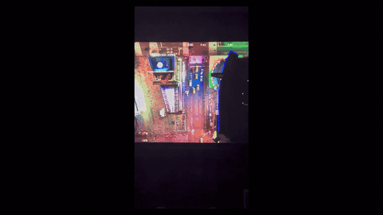

<br><br>

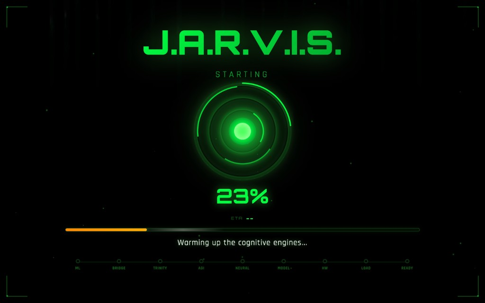

<br>
<sub><b>JARVIS Boot Sequence Interface</b> &nbsp;·&nbsp; System startup telemetry and cognitive engine warmup state</sub>

<br><br>

[](https://docs.google.com/videos/d/1inRKtPeCSqKbTvJfUnmulTkzJ4PX-HkqaIwWBpAUGdA/edit)

</div>

---

##  Data Structures & Algorithms

Every component below is production code running in the JARVIS ecosystem — not academic exercises.

<details>
<summary><b>Data Structures (50+ types)</b></summary>
<br>

| Category | Structures | Implementation |
|----------|-----------|----------------|
| **Trees** | Quadtree (spatial indexing), KD-Tree (nearest neighbor + radius search), Trie (prefix search), DAG (startup dependency graph), Scene Graph, Knowledge Graph, Process Tree | Python + Rust + C++ |
| **Graphs** | Reasoning Graph, Dependency Graph, Multi-Space Context Graph, Window Relationship Graph, Service Mesh Discovery Graph, LangGraph state machines, Causal Graphs (do-calculus) | Python |
| **Hash-Based** | Bloom Filters (3 languages), LSH Semantic Cache, LRU Cache, TTL Cache, Consistent Hashing, DashMap (lock-free concurrent), Bitmaps/Bitsets | Python + Rust + Swift |
| **Heaps & Queues** | Binary Heap (heapq), Priority Queue, Bounded Queue, Ring Buffer, Circular Buffer, Work-Stealing Queue, Zero-Copy IPC (mmap), Lock-Free SPSC Queue | Python + Rust + JS |
| **Concurrent** | Arc\<Mutex\<>>, RwLock, DashMap, mpsc channels, Vector Clock, CRDT, Distributed Lock, asyncio.Queue | Rust + Python |
| **Matrices & Tensors** | Matrix2D, Matrix3D (row-major), Sparse Matrices (nalgebra-sparse), PyTorch Tensors, Quantized Tensors (INT8/INT4), Embedding Vectors | Rust + C++ + Python |
| **Memory** | Memory Pool, Slab Allocator, Zero-Copy Buffers, Object Recycler, mmap Ring Buffers | Rust + Python |
| **State** | Finite State Machine, Event Bus, Event Store, Sliding Window, Bounded Collections | Python |

</details>

<details>
<summary><b>Algorithms (80+ implementations)</b></summary>
<br>

| Category | Algorithms | Where |
|----------|-----------|-------|
| **Resilience** | Circuit Breaker (5 variants), Exponential Backoff w/ Jitter, Graceful Degradation, Self-Healing, Leader Election, Distributed Locking, Distributed Transactions, Distributed Dedup | JARVIS + Prime |
| **Scheduling** | Round Robin, Token Bucket, Leaky Bucket, Sliding Window Rate Limiter, Work Stealing, Backpressure Control, Adaptive ML-Based Rate Limiting | All three repos |
| **Graph / Search** | Topological Sort (DAG), BFS/DFS, A\* Search, Dijkstra's Shortest Path, K-Nearest Neighbor, PageRank (file importance ranking) | All three repos |
| **Statistical / Bayesian** | Bayesian Inference (Beta-Bernoulli, Normal-Normal posteriors), Bayesian Confidence Fusion, Multi-Armed Bandit (Thompson Sampling, epsilon-greedy), Monte Carlo Validation, Kalman Filter (RSSI smoothing), Markov Chain Prediction | JARVIS + Prime |
| **ML Training** | LoRA/QLoRA, DPO (preference optimization), RLHF (PPO pipeline), FSDP (parameter sharding), MAML/Reptile (meta-learning), Federated Learning (FedAvg, FedProx, Byzantine-robust), Curriculum Learning, Causal Reasoning (do-calculus), Online Learning w/ EWC, World Model Training (Dreamer/MuZero-inspired), Knowledge Distillation (Hinton, FitNets, attention transfer, multi-teacher), Gradient Accumulation, Mixed Precision (BF16/FP16) | ReactorCore + Prime |
| **ML Inference** | Quantized INT8/INT4, Cosine Similarity, LSH, Vector Search, Anomaly Detection, Pattern Recognition, Goal Inference, Activity Recognition, Tiered Complexity Routing, Flash Attention | JARVIS + Prime |
| **Neural Networks** | Multi-Head Self-Attention, Dropout, BatchNorm, LayerNorm, LSTM + Attention, Feedforward w/ Backpropagation, Cognitive Layers (cross-attention + residual) | All three repos |
| **Clustering & Reduction** | K-Means, DBSCAN, PCA, Truncated SVD, TF-IDF Vectorization | JARVIS + Reactor |
| **Ensemble Methods** | Random Forest, Gradient Boosting, Isolation Forest, Ensemble STT (multi-model voting), Weighted Model Ensemble (majority/cascade) | JARVIS + Reactor |
| **Signal Processing** | VAD (WebRTC + Silero + CoreML), MFCC/Mel Filterbanks, Spectrogram, Anti-Spoofing, Barge-In Detection, ECAPA-TDNN Speaker Verification | JARVIS |
| **Compression** | Zstd, LZ4, Gzip/Zlib, Custom Vision Compression | Rust + Python |
| **Cryptography** | HMAC, SHA-256, MD5, JWT, Secure Password Hashing, File Integrity Checksums, Checkpoint Verification | All three repos |
| **Caching** | LRU Eviction, TTL Eviction, Predictive Cache Warming (EWMA + time-series), LSH Semantic Cache, Bloom Filter Negative Cache, Memoization (lru_cache) | All three repos |
| **Evolutionary** | Genetic Algorithm (Ouroboros self-programming loop — B+ branch-isolated sagas, v262.0 fully activated) | JARVIS |
| **Concurrency** | Deadlock Prevention, CPU Affinity Pinning, Parallel DAG Initialization, Zero-Copy mmap IPC, Lock-Free Channels | JARVIS + Prime |
| **GPU / SIMD** | Metal Compute Shaders, ARM64 NEON SIMD Intrinsics | JARVIS (Rust + C + Assembly) |
| **C++ ML (mlforge)** | Linear Regression (Ridge/Lasso), Logistic Regression, Decision Tree (Gini), Neural Net (backprop), Matrix Serialization, KD-Tree, Graph (BFS/DFS), Trie | ReactorCore |

</details>

---

##  GitHub Stats

<div align="center">

<a href="https://github.com/drussell23">
  
</a>
<a href="https://github.com/drussell23">
  
</a>

<br>

<a href="https://github.com/drussell23">
  
</a>

<br>

<a href="https://github.com/drussell23">
  
</a>

<br>

<a href="https://github.com/drussell23">
  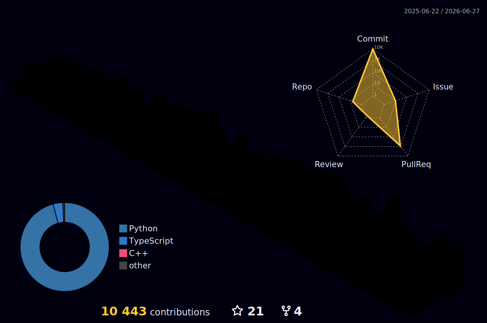
</a>

</div>

<div align="center">

<picture>
  <source media="(prefers-color-scheme: dark)" srcset="https://raw.githubusercontent.com/drussell23/drussell23/output/github-snake-dark.svg" />
  <source media="(prefers-color-scheme: light)" srcset="https://raw.githubusercontent.com/drussell23/drussell23/output/github-snake.svg" />
  
</picture>

</div>

<div align="center">

<a href="https://github.com/ryo-ma/github-profile-trophy">
  
</a>

</div>

---

##  Metrics Dashboard

<div align="center">

<a href="https://github.com/drussell23">
  
</a>

</div>

---

##  The JARVIS Ecosystem

JARVIS is not a chatbot wrapper. It is a distributed AI operating system composed of three interdependent repositories — each a standalone production system, together forming a self-improving autonomous intelligence.

### Hero Architecture (TL;DR)

- **Single command control plane:** `python3 unified_supervisor.py` boots Body, Mind, and Forge with deterministic lifecycle ownership
- **Trinity operating model:** `JARVIS` executes, `JARVIS-Prime` reasons/routes, `ReactorCore` trains and redeploys
- **Reliability-first inference:** policy-based failover from GCP golden image to local Apple Silicon to API fallback
- **Closed learning loop:** runtime telemetry flows to Reactor training, then gated deployment returns improved models to Prime
- **Native autonomy stack:** async agent mesh, Google Workspace workflows, voice biometrics, and vision-driven macOS control
- **Safety by design:** policy gates, contract checks, kill-switch controls, circuit breakers, and probation-based rollback

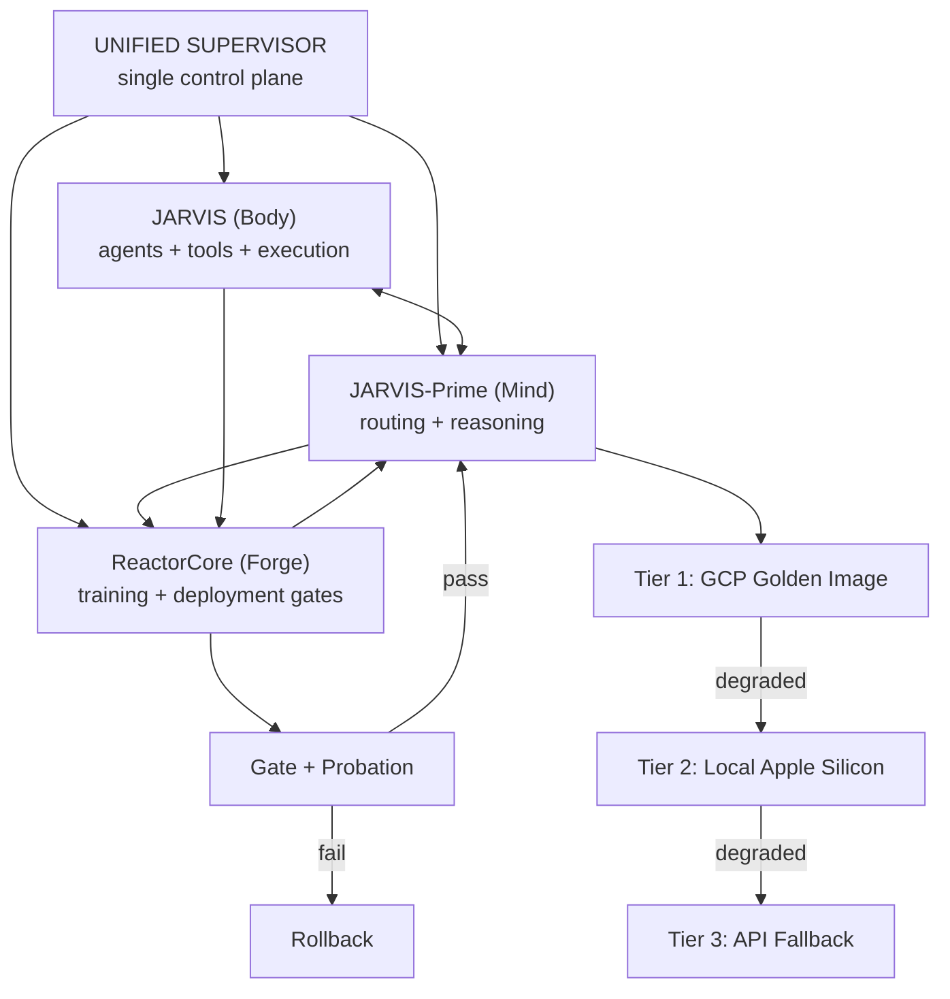
```mermaid
flowchart TD
    K["UNIFIED SUPERVISOR<br/>single control plane"] --> B["JARVIS (Body)<br/>agents + tools + execution"]
    K --> P["JARVIS-Prime (Mind)<br/>routing + reasoning"]
    K --> R["ReactorCore (Forge)<br/>training + deployment gates"]

    B <--> P
    P --> R
    R --> P
    B --> R

    P --> T1["Tier 1: GCP Golden Image"]
    T1 -->|"degraded"| T2["Tier 2: Local Apple Silicon"]
    T2 -->|"degraded"| T3["Tier 3: API Fallback"]

    R --> G["Gate + Probation"]
    G -->|"pass"| P
    G -->|"fail"| RB["Rollback"]
```

### Triple Authority Resolution — Status Overview

Three repos previously made independent lifecycle decisions (restart/health/kill), which created restart storms, readiness split-brain, and contract drift. This architecture is now unified under a single root authority model.

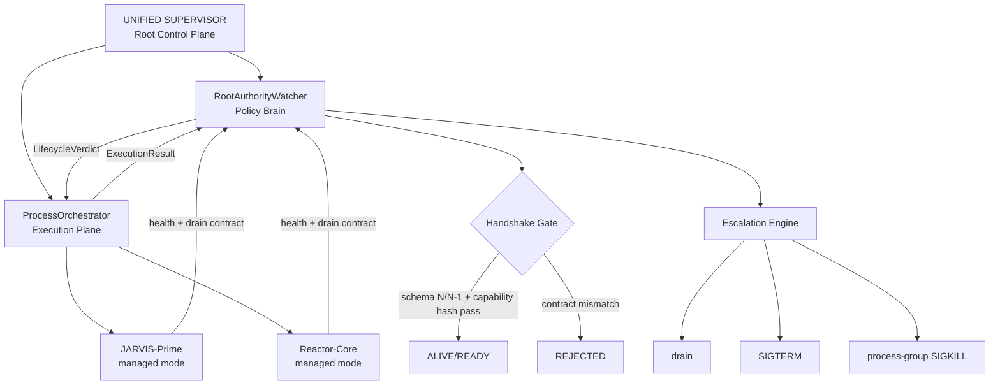
```mermaid
flowchart TD
    U["UNIFIED SUPERVISOR<br/>Root Control Plane"] --> W["RootAuthorityWatcher<br/>Policy Brain"]
    U --> O["ProcessOrchestrator<br/>Execution Plane"]
    O --> P["JARVIS-Prime<br/>managed mode"]
    O --> R["Reactor-Core<br/>managed mode"]

    W -->|LifecycleVerdict| O
    O -->|ExecutionResult| W
    P -->|health + drain contract| W
    R -->|health + drain contract| W

    W --> H{"Handshake Gate"}
    H -->|"schema N/N-1 + capability hash pass"| READY["ALIVE/READY"]
    H -->|"contract mismatch"| REJECT["REJECTED"]

    W --> E["Escalation Engine"]
    E --> D["drain"]
    E --> T["SIGTERM"]
    E --> K["process-group SIGKILL"]
```

<details>
<summary><b>What we built (21 tasks, 5 waves, 3 repos)</b></summary>
<br>

- **Wave 0 — Foundation types:** canonical lifecycle contracts (`LifecycleAction`, `SubsystemState`, `ProcessIdentity`, `LifecycleVerdict`, policy/timeout structures) + managed-mode contract + golden conformance tests
- **Wave 1 — Root authority watcher:** lifecycle state machine ownership, verdict emission, incident dedup, and policy/execution separation via `VerdictExecutor`
- **Wave 2 — Prime/Reactor conformance:** managed-mode behavior (`JARVIS_ROOT_MANAGED`), health envelope enrichment, authenticated `/lifecycle/drain`
- **Wave 3 — Orchestrator integration + shadow mode:** `ProcessOrchestrator` adapter methods wired; active crash watch (`proc.wait`) + jittered health polling
- **Wave 4 — Activation hardening:** active verdict dispatch, contract hash gating at boot handshake, policy delegation hooks for restart/health ownership

</details>

<details>
<summary><b>What this resolved</b></summary>
<br>

- **Restart storms:** single restart policy with budgeted windows and deduplication
- **Readiness split-brain:** unified two-field liveness/readiness state ownership
- **Contract drift:** cross-repo managed-mode parity with conformance tests and compatibility gates
- **Crash blind spots:** ms-latency process-exit detection plus health-path observability
- **Competing supervisors:** Prime/Reactor demoted to managed mode while root authority owns lifecycle decisions
- **Escalation ambiguity:** deterministic kill ladder (`drain -> SIGTERM -> process-group SIGKILL`)
- **PID reuse risk:** identity validation strengthened via multi-factor `ProcessIdentity`
- **Control-plane auth gaps:** HMAC-authenticated lifecycle commands and session-aware checks

</details>

<details>
<summary><b>Production rollout path (remaining ops work)</b></summary>
<br>

1. **Shadow soak:** run in `shadow` mode and verify decision parity against legacy behavior  
2. **Per-subsystem activation:** promote one subsystem at a time (`reactor-core` then `jarvis-prime`)  
3. **Final policy cut-wire:** fully bypass legacy autonomous monitor decisions when delegation flags are enabled  
4. **CI anti-drift:** enforce cross-repo parity checks for managed-mode contract files on every PR

</details>

<details>
<summary><b>Hidden profile bullet packs (copy-ready)</b></summary>
<br>

**Ultra-short TL;DR**
- **Triple Authority Fixed:** one root control plane governs restart/readiness/lifecycle
- **Safe by Contract:** managed-mode + authenticated lifecycle endpoints + handshake gating
- **Staged Rollout:** shadow parity -> subsystem activation -> full active cutover

**Recruiter-friendly**
- **Architecture leadership:** unified three competing supervisors into one production control plane
- **Reliability outcome:** removed restart storms and readiness split-brain via centralized lifecycle policy
- **Security hardening:** added authenticated lifecycle controls and contract-gated activation
- **Operational rigor:** designed staged rollout for safe production adoption

**Infra-architect**
- **Control-plane convergence:** root watcher owns lifecycle state transitions across Body/Prime/Reactor
- **Policy/execution isolation:** watcher emits verdicts; orchestrator executes side effects
- **Deterministic escalation:** bounded `drain -> term -> group-kill` with race-safe identity checks
- **Protocol hardening:** schema/capability handshake gates + managed-mode health/drain envelopes
- **Progressive activation:** shadow validation, per-subsystem enablement, legacy path retirement

</details>

### Disease 1: God File / Monolith Paradox

`unified_supervisor.py` grew into a ~96K-line orchestration monolith with multiple high-impact domains in one file. The risk is not just size; it is **coupling density**: local edits can create non-local regressions.

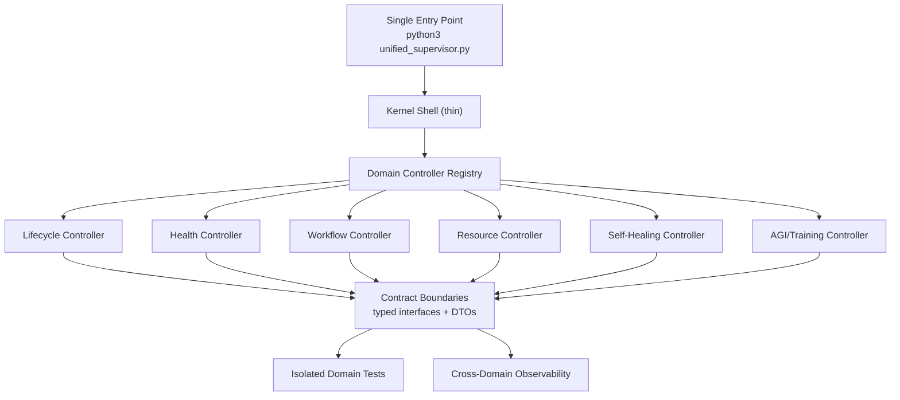
```mermaid
flowchart TD
    E["Single Entry Point<br/>python3 unified_supervisor.py"] --> S["Kernel Shell (thin)"]
    S --> R["Domain Controller Registry"]

    R --> L["Lifecycle Controller"]
    R --> H["Health Controller"]
    R --> W["Workflow Controller"]
    R --> M["Resource Controller"]
    R --> X["Self-Healing Controller"]
    R --> A["AGI/Training Controller"]

    L --> C["Contract Boundaries<br/>typed interfaces + DTOs"]
    H --> C
    W --> C
    M --> C
    X --> C
    A --> C

    C --> T["Isolated Domain Tests"]
    C --> O["Cross-Domain Observability"]
```

<details>
<summary><b>Why this is dangerous</b></summary>
<br>

- **Reasoning collapse:** too many orthogonal responsibilities in one file
- **Test isolation gap:** difficult to unit-test a single subsystem without broad kernel context
- **High merge friction:** concentrated edit surface increases conflict rate
- **Refactor risk:** tooling and human review quality degrade as coupling grows
- **Mandate conflict:** monolith bottleneck violates "no single structural choke point"

</details>

<details>
<summary><b>Structural cure path</b></summary>
<br>

1. **Preserve single boot command** while shrinking policy from the shell  
2. **Extract domain controllers** behind protocol boundaries  
3. **Replace direct cross-calls** with typed contract interfaces  
4. **Enforce isolation tests** per domain before integration tests  
5. **Ship in waves with parity gates** to avoid behavioral drift

</details>

<details>
<summary><b>Hidden profile bullets (copy-ready)</b></summary>
<br>

**Ultra-short TL;DR**
- **Monolith Risk Neutralized (in progress):** convert a 96K-line supervisor choke point into contract-bounded controllers
- **Single Entry Point Preserved:** one boot command, modular internals
- **Safer Evolution:** isolation tests + parity-gated extraction waves

**Recruiter-friendly**
- **Architecture insight:** identified the monolith paradox as the largest systemic reliability and velocity risk
- **Execution strategy:** designed a phased decomposition that keeps runtime stable while reducing coupling
- **Engineering rigor:** paired extraction with contract boundaries and isolation testing to prevent regressions

**Infra-architect**
- **Kernel shell model:** retain entrypoint authority but move domain policy to controller registry
- **Protocol-first decomposition:** typed interfaces replace direct cross-domain invocation
- **Risk-managed migration:** parity validation, observability gates, and staged rollout per domain

</details>

### System Architecture

<details>
<summary><b>Purpose, Problem, Challenge, Solution</b></summary>
<br>

- **Purpose:** Define the three-system operating model (`JARVIS`, `JARVIS-Prime`, `ReactorCore`) under one unified kernel.
- **Problem:** Most AI systems stop at a single model endpoint and fail at end-to-end autonomy, coordination, and lifecycle management.
- **Core Challenge:** Keep orchestration, inference, and training decoupled enough to scale independently while still behaving like one product.
- **What This Solves:** Creates a durable systems contract: `JARVIS` runs operations, `Prime` serves intelligence, `Reactor` continuously improves intelligence.

</details>

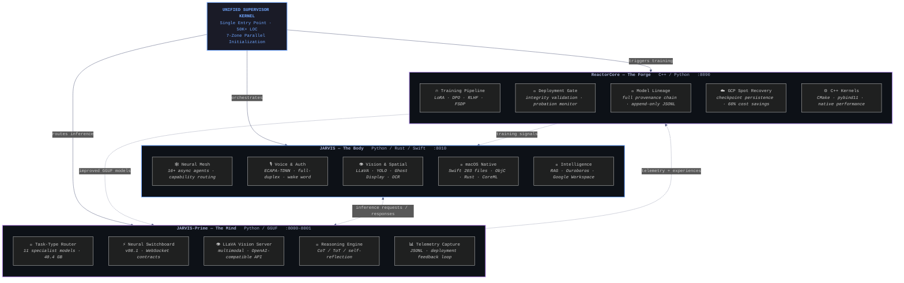
```mermaid
%%{init: {'theme': 'dark', 'themeVariables': { 'primaryColor': '#1a1b27', 'primaryTextColor': '#a9b1d6', 'primaryBorderColor': '#70a5fd', 'lineColor': '#545c7e', 'secondaryColor': '#24283b', 'tertiaryColor': '#1a1b27', 'fontSize': '14px', 'fontFamily': 'JetBrains Mono, monospace' }}}%%

flowchart TD
    KERNEL["<b>UNIFIED SUPERVISOR KERNEL</b><br/>Single Entry Point · 50K+ LOC<br/>7-Zone Parallel Initialization"]

    KERNEL -->|"orchestrates"| JARVIS
    KERNEL -->|"routes inference"| PRIME
    KERNEL -->|"triggers training"| REACTOR

    subgraph JARVIS["<b>JARVIS — The Body</b> &nbsp; Python / Rust / Swift &nbsp; :8010"]
        direction TB
        J1["🕸️ Neural Mesh<br/><i>16+ async agents · capability routing</i>"]
        J2["🎙️ Voice & Auth<br/><i>ECAPA-TDNN · full-duplex · wake word</i>"]
        J3["👁️ Vision & Spatial<br/><i>LLaVA · YOLO · Ghost Display · OCR</i>"]
        J4["🍎 macOS Native<br/><i>Swift 203 files · ObjC · Rust · CoreML</i>"]
        J5["🧠 Intelligence<br/><i>RAG · Ouroboros · Google Workspace</i>"]
    end

    subgraph PRIME["<b>JARVIS-Prime — The Mind</b> &nbsp; Python / GGUF &nbsp; :8000-8001"]
        direction TB
        P1["📡 Task-Type Router<br/><i>11 specialist models · 40.4 GB</i>"]
        P2["⚡ Neural Switchboard<br/><i>v98.1 · WebSocket contracts</i>"]
        P3["👁️ LLaVA Vision Server<br/><i>multimodal · OpenAI-compatible API</i>"]
        P4["💭 Reasoning Engine<br/><i>CoT / ToT / self-reflection</i>"]
        P5["📊 Telemetry Capture<br/><i>JSONL · deployment feedback loop</i>"]
    end

    subgraph REACTOR["<b>ReactorCore — The Forge</b> &nbsp; C++ / Python &nbsp; :8090"]
        direction TB
        R1["🔥 Training Pipeline<br/><i>LoRA · DPO · RLHF · FSDP</i>"]
        R2["🚪 Deployment Gate<br/><i>integrity validation · probation monitor</i>"]
        R3["🧬 Model Lineage<br/><i>full provenance chain · append-only JSONL</i>"]
        R4["☁️ GCP Spot Recovery<br/><i>checkpoint persistence · 60% cost savings</i>"]
        R5["⚙️ C++ Kernels<br/><i>CMake · pybind11 · native performance</i>"]
    end

    PRIME -.->|"telemetry + experiences"| REACTOR
    REACTOR -.->|"improved GGUF models"| PRIME
    JARVIS <-.->|"inference requests / responses"| PRIME
    REACTOR -.->|"training signals"| JARVIS

    style KERNEL fill:#1a1b27,stroke:#70a5fd,stroke-width:2px,color:#70a5fd
    style JARVIS fill:#0d1117,stroke:#70a5fd,stroke-width:2px,color:#a9b1d6
    style PRIME fill:#0d1117,stroke:#bf91f3,stroke-width:2px,color:#a9b1d6
    style REACTOR fill:#0d1117,stroke:#bb9af7,stroke-width:2px,color:#a9b1d6
```

### Data Flow

<details>
<summary><b>Purpose, Problem, Challenge, Solution</b></summary>
<br>

- **Purpose:** Show the runtime request path from multimodal inputs to routed inference and back to user-visible action.
- **Problem:** Input streams (voice, screen, command) are heterogeneous and require different model strategies and latencies.
- **Core Challenge:** Route by task type in real time while capturing high-quality telemetry for future model improvement.
- **What This Solves:** Demonstrates a closed execution path where each response both serves the user now and improves the system later.

</details>

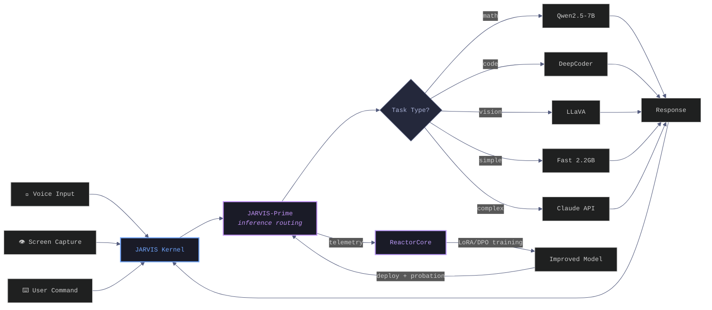
```mermaid
%%{init: {'theme': 'dark', 'themeVariables': { 'primaryColor': '#1a1b27', 'primaryTextColor': '#a9b1d6', 'lineColor': '#545c7e', 'fontSize': '13px', 'fontFamily': 'JetBrains Mono, monospace' }}}%%

flowchart LR
    A["🎤 Voice Input"] --> B["JARVIS Kernel"]
    C["👁️ Screen Capture"] --> B
    D["⌨️ User Command"] --> B
    B --> E["JARVIS-Prime<br/><i>inference routing</i>"]
    E --> F{"Task Type?"}
    F -->|"math"| G["Qwen2.5-7B"]
    F -->|"code"| H["DeepCoder"]
    F -->|"vision"| I["LLaVA"]
    F -->|"simple"| J["Fast 2.2GB"]
    F -->|"complex"| K["Claude API"]
    G & H & I & J & K --> L["Response"]
    L --> B
    E -->|"telemetry"| M["ReactorCore"]
    M -->|"LoRA/DPO training"| N["Improved Model"]
    N -->|"deploy + probation"| E

    style B fill:#1a1b27,stroke:#70a5fd,stroke-width:2px,color:#70a5fd
    style E fill:#1a1b27,stroke:#bf91f3,stroke-width:2px,color:#bf91f3
    style M fill:#1a1b27,stroke:#bb9af7,stroke-width:2px,color:#bb9af7
    style F fill:#24283b,stroke:#545c7e,stroke-width:1px,color:#a9b1d6
```

### Three-Tier Inference Routing

<details>
<summary><b>Purpose, Problem, Challenge, Solution</b></summary>
<br>

- **Purpose:** Define a deterministic fallback ladder for reliability under changing infrastructure and hardware conditions.
- **Problem:** A single inference backend is a single point of failure (downtime, cold starts, local resource pressure, API outages).
- **Core Challenge:** Preserve quality and uptime while controlling cost and avoiding hard dependency on any one execution tier.
- **What This Solves:** Guarantees service continuity through policy-based failover: `GCP` -> `Local Metal` -> `Claude API`.

</details>

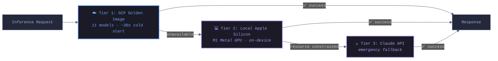
```mermaid
%%{init: {'theme': 'dark', 'themeVariables': { 'primaryColor': '#1a1b27', 'primaryTextColor': '#a9b1d6', 'lineColor': '#545c7e', 'fontSize': '13px', 'fontFamily': 'JetBrains Mono, monospace' }}}%%

flowchart LR
    REQ["Inference Request"] --> T1
    T1["☁️ Tier 1: GCP Golden Image<br/><i>11 models · ~30s cold start</i>"]
    T1 -->|"unavailable"| T2["💻 Tier 2: Local Apple Silicon<br/><i>M1 Metal GPU · on-device</i>"]
    T2 -->|"resource constrained"| T3["🔑 Tier 3: Claude API<br/><i>emergency fallback</i>"]
    T1 -->|"✅ success"| RES["Response"]
    T2 -->|"✅ success"| RES
    T3 -->|"✅ success"| RES

    style T1 fill:#1a1b27,stroke:#70a5fd,stroke-width:2px,color:#70a5fd
    style T2 fill:#1a1b27,stroke:#bf91f3,stroke-width:2px,color:#bf91f3
    style T3 fill:#1a1b27,stroke:#bb9af7,stroke-width:2px,color:#bb9af7
    style REQ fill:#24283b,stroke:#545c7e,stroke-width:1px,color:#a9b1d6
    style RES fill:#24283b,stroke:#545c7e,stroke-width:1px,color:#a9b1d6
```

### Trinity Autonomy Wiring (Phase 2)

<details>
<summary><b>Purpose, Problem, Challenge, Solution</b></summary>
<br>

- **Purpose:** Wire autonomy lifecycle events through the Trinity loop so the system can learn from its own autonomous actions.
- **Problem:** JARVIS Body performs autonomous actions (Google Workspace agent) but the outcomes are not captured as structured training signals.
- **Core Challenge:** Events must be strictly validated, deduplicated, and classified before reaching the training pipeline — malformed or replayed events would corrupt model weights.
- **What This Solves:** Creates a closed feedback loop where autonomous actions generate training data, improving future autonomy decisions without manual intervention.

</details>

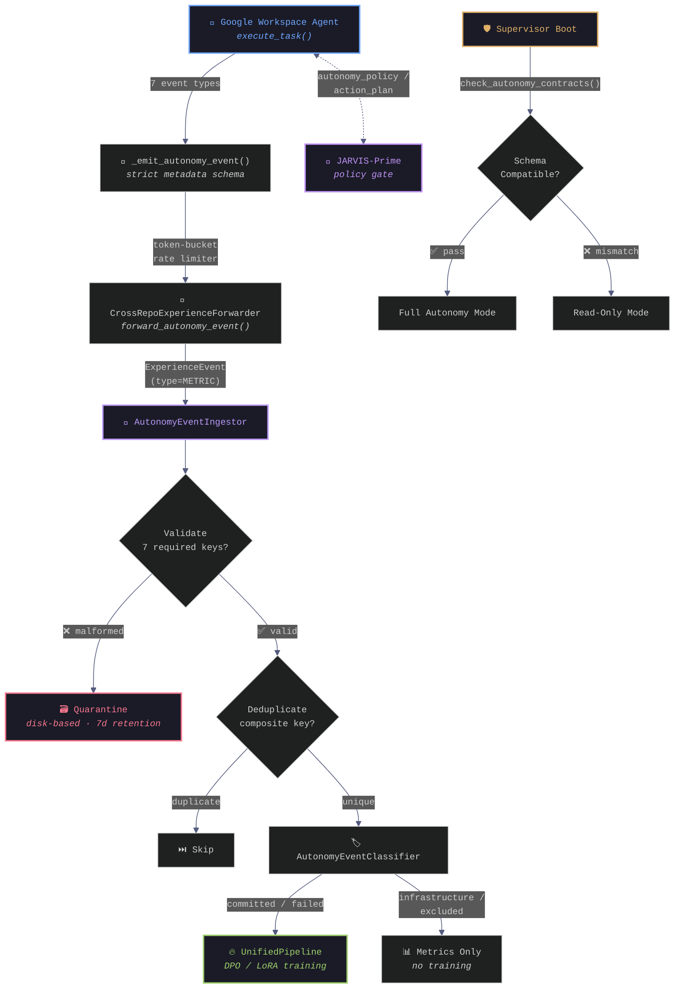
```mermaid
%%{init: {'theme': 'dark', 'themeVariables': { 'primaryColor': '#1a1b27', 'primaryTextColor': '#a9b1d6', 'lineColor': '#545c7e', 'fontSize': '13px', 'fontFamily': 'JetBrains Mono, monospace' }}}%%

flowchart TD
    AGENT["🤖 Google Workspace Agent<br/><i>execute_task()</i>"]

    AGENT -->|"7 event types"| EMIT["📡 _emit_autonomy_event()<br/><i>strict metadata schema</i>"]
    EMIT -->|"token-bucket<br/>rate limiter"| FWD["🔀 CrossRepoExperienceForwarder<br/><i>forward_autonomy_event()</i>"]

    FWD -->|"ExperienceEvent<br/>(type=METRIC)"| ING["🔬 AutonomyEventIngestor"]

    ING --> V{"Validate<br/>7 required keys?"}
    V -->|"❌ malformed"| Q["🗃️ Quarantine<br/><i>disk-based · 7d retention</i>"]
    V -->|"✅ valid"| D{"Deduplicate<br/>composite key?"}
    D -->|"duplicate"| SKIP["⏭️ Skip"]
    D -->|"unique"| CLS["🏷️ AutonomyEventClassifier"]

    CLS -->|"committed / failed"| TRAIN["🔥 UnifiedPipeline<br/><i>DPO / LoRA training</i>"]
    CLS -->|"infrastructure /<br/>excluded"| EXCLUDE["📊 Metrics Only<br/><i>no training</i>"]

    AGENT <-.->|"autonomy_policy /<br/>action_plan"| PRIME["💭 JARVIS-Prime<br/><i>policy gate</i>"]

    SUP["🛡️ Supervisor Boot"] -->|"check_autonomy_contracts()"| COMPAT{"Schema<br/>Compatible?"}
    COMPAT -->|"✅ pass"| FULL["Full Autonomy Mode"]
    COMPAT -->|"❌ mismatch"| RO["Read-Only Mode"]

    style AGENT fill:#1a1b27,stroke:#70a5fd,stroke-width:2px,color:#70a5fd
    style PRIME fill:#1a1b27,stroke:#bf91f3,stroke-width:2px,color:#bf91f3
    style ING fill:#1a1b27,stroke:#bb9af7,stroke-width:2px,color:#bb9af7
    style TRAIN fill:#1a1b27,stroke:#9ece6a,stroke-width:2px,color:#9ece6a
    style Q fill:#1a1b27,stroke:#f7768e,stroke-width:2px,color:#f7768e
    style SUP fill:#1a1b27,stroke:#e0af68,stroke-width:2px,color:#e0af68
```

**How it works:**

- **Body emits 7 canonical events** — Every autonomous action (email send, calendar create, doc edit) emits a lifecycle event: `intent_written` (about to execute), `committed` (success), `failed` (error), `policy_denied` (blocked by Prime), `deduplicated` (suppressed duplicate), `superseded` (stale intent), `no_journal_lease` (fail-closed safety)
- **Strict metadata schema** — Each event carries 7 required keys (`autonomy_event_type`, `autonomy_schema_version`, `idempotency_key`, `trace_id`, `correlation_id`, `action`, `request_kind`). Malformed events are quarantined to disk, never silently coerced
- **Token-bucket rate limiter** — Prevents replay storms during startup reconciliation (default: 50 events/second)
- **Effectively-once semantics** — Deduplication by composite key `(idempotency_key, autonomy_event_type, trace_id)` with a 50K sliding window
- **Centralized classification** — `AutonomyEventClassifier` is the single source of truth: only `committed` and `failed` are trainable; infrastructure events are excluded from training but retained for observability
- **Boot contract validation** — Supervisor checks schema version compatibility across all three repos at startup. Any mismatch degrades to read-only autonomy mode (no autonomous writes)
- **Prime as policy gate** — Body attaches `autonomy_policy` (allowed/denied actions, risk thresholds) to commands; Prime validates and returns structured `action_plan` with `policy_compatible` flag

### Ouroboros + Venom + Trinity Consciousness — Autonomous Self-Development

<details>
<summary><b>Purpose, Problem, Challenge, Solution</b></summary>
<br>

- **Purpose:** Enable JARVIS to autonomously detect, generate, validate, and apply code improvements across all three repos (JARVIS, JARVIS-Prime, Reactor-Core) in real time — without human intervention.
- **Problem:** Cross-repo code applies without isolation are dangerous: partial failures leave repos in inconsistent states, no rollback exists, TARGET_MOVED (another commit landing mid-apply) goes undetected, and forensics branches are lost on failure. Polling-based sensors waste 5+ minutes before detecting work. Single-provider failures permanently kill the pipeline.
- **Core Challenge:** Production-grade saga apply safety across three independent git repos, sub-second event-driven intake, adaptive cost-optimized provider routing with predictive recovery, and real API cost tracking — all without changing the external execution contract.
- **What This Solves:** Full activation of the autonomous self-development loop with B+ branch-isolated sagas, a **Unified Event Spine** (FileWatchGuard + TrinityEventBus → sensors react in <1s), **adaptive provider routing** (DoubleWord 397B first at $0.10/$0.40/M, Claude fallback at $3/$15/M with failure-mode-aware exponential backoff), **battle test runner** with real API cost tracking, and **self-healing** (QUEUE_ONLY auto-recovery, poisoned connector detection, transient failure resilience).

</details>

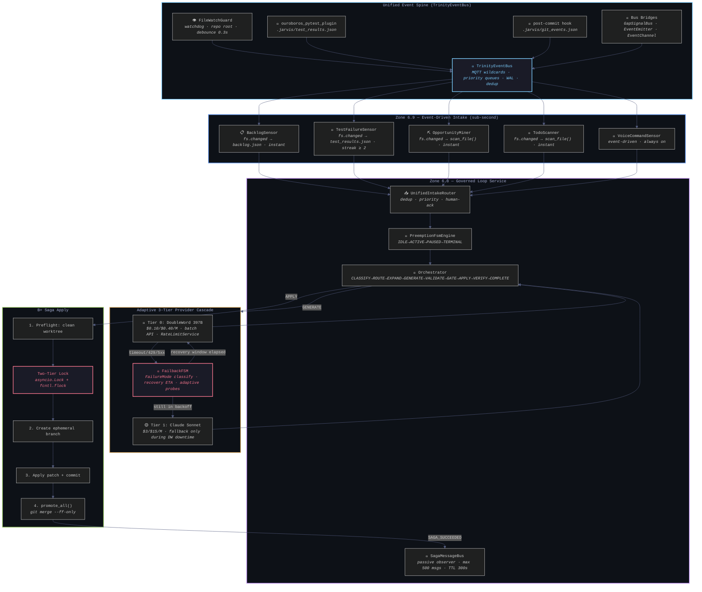
```mermaid
%%{init: {'theme': 'dark', 'themeVariables': { 'primaryColor': '#1a1b27', 'primaryTextColor': '#a9b1d6', 'lineColor': '#545c7e', 'fontSize': '13px', 'fontFamily': 'JetBrains Mono, monospace' }}}%%

flowchart TD
    subgraph SPINE["Unified Event Spine (TrinityEventBus)"]
        FW["👁️ FileWatchGuard<br/><i>watchdog · repo root · debounce 0.3s</i>"]
        PYTEST["🧪 ouroboros_pytest_plugin<br/><i>.jarvis/test_results.json</i>"]
        GITHOOK["🔗 post-commit hook<br/><i>.jarvis/git_events.json</i>"]
        BRIDGES["🔌 Bus Bridges<br/><i>GapSignalBus · EventEmitter · EventChannel</i>"]
        TEB["📡 TrinityEventBus<br/><i>MQTT wildcards · priority queues · WAL · dedup</i>"]
        FW & PYTEST & GITHOOK & BRIDGES --> TEB
    end

    subgraph INTAKE["Zone 6.9 — Event-Driven Intake (sub-second)"]
        B["📋 BacklogSensor<br/><i>fs.changed → backlog.json · instant</i>"]
        T["🧪 TestFailureSensor<br/><i>fs.changed → test_results.json · streak ≥ 2</i>"]
        M["⛏️ OpportunityMiner<br/><i>fs.changed → scan_file() · instant</i>"]
        TODO["📝 TodoScanner<br/><i>fs.changed → scan_file() · instant</i>"]
        V["🎤 VoiceCommandSensor<br/><i>event-driven · always on</i>"]
    end

    subgraph GLS["Zone 6.8 — Governed Loop Service"]
        Q["📥 UnifiedIntakeRouter<br/><i>dedup · priority · human-ack</i>"]
        FSM["🔄 PreemptionFsmEngine<br/><i>IDLE→ACTIVE→PAUSED→TERMINAL</i>"]
        ORCH["🎯 Orchestrator<br/><i>CLASSIFY→ROUTE→EXPAND→GENERATE→VALIDATE→GATE→APPLY→VERIFY→COMPLETE</i>"]
        BUS["📡 SagaMessageBus<br/><i>passive observer · max 500 msgs · TTL 300s</i>"]
    end

    subgraph ROUTING["Adaptive 3-Tier Provider Cascade"]
        DW["🔵 Tier 0: DoubleWord 397B<br/><i>$0.10/$0.40/M · batch API · RateLimitService</i>"]
        CL["🟡 Tier 1: Claude Sonnet<br/><i>$3/$15/M · fallback only during DW downtime</i>"]
        FBACK["🔄 FailbackFSM<br/><i>FailureMode classify · recovery ETA · adaptive probes</i>"]
        DW -->|"timeout/429/5xx"| FBACK
        FBACK -->|"recovery window elapsed"| DW
        FBACK -->|"still in backoff"| CL
    end

    subgraph SAGA["B+ Saga Apply"]
        PRE["1. Preflight: clean worktree"]
        BR["2. Create ephemeral branch"]
        AP["3. Apply patch + commit"]
        LOCK["Two-Tier Lock<br/><i>asyncio.Lock + fcntl.flock</i>"]
        PROM["4. promote_all()<br/><i>git merge --ff-only</i>"]
    end

    TEB --> B & T & M & TODO & V
    B & T & M & TODO & V --> Q
    Q --> FSM --> ORCH
    ORCH -->|"GENERATE"| ROUTING
    DW & CL --> ORCH
    ORCH -->|"APPLY"| PRE
    PRE --> LOCK --> BR --> AP --> PROM
    PROM -->|"SAGA_SUCCEEDED"| BUS

    style SPINE fill:#0d1117,stroke:#7dcfff,stroke-width:2px,color:#a9b1d6
    style INTAKE fill:#0d1117,stroke:#70a5fd,stroke-width:2px,color:#a9b1d6
    style GLS fill:#0d1117,stroke:#bf91f3,stroke-width:2px,color:#a9b1d6
    style ROUTING fill:#0d1117,stroke:#e0af68,stroke-width:2px,color:#a9b1d6
    style SAGA fill:#0d1117,stroke:#9ece6a,stroke-width:2px,color:#a9b1d6
    style TEB fill:#1a1b27,stroke:#7dcfff,stroke-width:2px,color:#7dcfff
    style FBACK fill:#1a1b27,stroke:#f7768e,stroke-width:2px,color:#f7768e
    style LOCK fill:#1a1b27,stroke:#f7768e,stroke-width:2px,color:#f7768e
```

**How it works:**

- **Unified Event Spine** — A `FileWatchGuard` (watchdog) watches the repo root. On any `.py`/`.json` change, it publishes `fs.changed.*` events to `TrinityEventBus` (MQTT-style topics, priority queues, WAL persistence, cross-repo transport). Three adapter bridges forward events from `GapSignalBus`, `EventEmitter`, and `EventChannelServer` into the unified spine — **0 of 123 importing files changed**.
- **Sub-second sensor reactions** — Sensors subscribe to `TrinityEventBus` instead of polling. `BacklogSensor` reacts to `backlog.json` changes instantly. `TodoScannerSensor` and `OpportunityMinerSensor` do **incremental single-file scans** on changed files. `TestFailureSensor` consumes structured results from a pytest plugin (`.jarvis/test_results.json`) — no subprocess spawning, no regex parsing. A `post-commit` git hook writes `.jarvis/git_events.json` for `DocStalenessSensor` and `CrossRepoDriftSensor`.
- **6-Layer Cost Optimization** — DoubleWord 397B now supports **real-time** `/v1/chat/completions` with full Venom tool loop at $0.10/$0.40/M (30-37x cheaper than Claude). Claude fallback uses **prompt caching** (`cache_control: ephemeral`, 90% input savings — $0.30/M cached vs $3/M uncached). **Smart max_tokens**: 1024 during Venom tool rounds, 8192 only for final patch (~75% output reduction). **Prompt compression**: 20KB max per file (was 65KB, ~60% input reduction — Venom can `read_file` for details). **Complexity routing**: TRIVIAL tasks skip Venom entirely (one-shot, cheapest path). **Adaptive failover**: FailbackFSM routes to cheapest provider with recovery prediction. **Result: 50-150+ operations per $0.50 budget** (was 5-15 before optimization).
- **Deadline budget allocation** — The generation deadline is split deterministically: Tier 0 gets 50% (max 90s), Tier 1 gets a guaranteed 45s reserve. Within Tier 1, the primary gets 65%, fallback gets a guaranteed 20s minimum. No single tier can starve downstream fallbacks.
- **Venom: Agentic Execution Layer** — Named after the Marvel symbiote. The `ToolLoopCoordinator` transforms Ouroboros from a one-shot patch generator into a **multi-turn agentic loop**. During generation, the provider calls `read_file`, `search_code`, `run_tests`, and `get_callers` — reading the codebase, running tests, and revising across multiple turns (up to 5 rounds). `GoverningToolPolicy` enforces repo containment on every tool call. When L1 validation fails, the **L2 Repair Engine** takes over: `generate → test → classify failure → revise` (up to 5 iterations, 120s timebox, failure-class-aware retry budgets).
- **Trinity Consciousness: Metacognition** — Zone 6.11: the **soul** of the organism. 4 core engines (HealthCortex, MemoryEngine, DreamEngine, ProphecyEngine) + 3 fusion engines (CAI Contextual Awareness, SAI Situational Awareness, UAE Unified Awareness). **MemoryEngine** records every operation outcome and builds per-file reputation (success rate, fragility score, co-failure tracking, 168h TTL). **ProphecyEngine** predicts regression risk from historical patterns. **ConsciousnessBridge** injects intelligence into the pipeline: regression assessment at CLASSIFY, fragile file context at GENERATE RETRY, outcome recording at POST-APPLY. The organism **learns from its own history** across sessions.
- **Self-healing** — Transient failures stay in `FALLBACK_ACTIVE`. `QUEUE_ONLY` auto-recovers on probe success. Poisoned connectors detected and replaced. Background polls capped at 3 concurrent.
- **Thought Log** — `.jarvis/ouroboros_thoughts.jsonl` records every reasoning step: what memories were recalled, which tools were called and why, generation strategy, L2 repair progress, and outcome learning. Visible in real time with `-v`. The user follows the organism's thought process like a conversation.
- **Autonomous Commit Signature** — Every commit includes a `Generated-By: Ouroboros + Venom + Consciousness` trailer and `Signed-off-by: JARVIS Ouroboros <ouroboros@jarvis.local>`. The signature is dynamic: `+ Venom` appears when tool use was involved, `+ Consciousness` when memory/prediction contributed.
- **Strategic Direction Awareness** — `StrategicDirectionService` reads the Manifesto and architecture docs on boot, extracts the 7 core principles, and injects them into every generation prompt. The organism understands the developer's architectural vision — generates async code, maintains cross-repo contracts, adds observability, prefers structural repair over shortcuts. Not generic fixes, **Manifesto-aligned code**.
- **Parallel Execution** — `BackgroundAgentPool` (2 workers) processes operations concurrently. While one operation generates code (Venom tool loop), another runs tests, a third applies patches. ~30 concurrent async tasks total: 2 operational hands, 15 sensory nerves, 7 consciousness engines, 5 infrastructure monitors.
- **Battle Test Runner** — `scripts/ouroboros_battle_test.py` boots the full stack: Strategic Direction + Consciousness + Venom + Event Spine + Adaptive Routing + Goal Memory + Parallel Execution. Real API cost tracking every 5s. Every commit signed `Generated-By: Ouroboros + Venom + Consciousness`.
- **B+ branch isolation** — Ephemeral branches per saga, `git merge --ff-only` promote, two-tier locking (asyncio + fcntl), deterministic deadlock-free.

**The complete organism — 6 layers working together:**

```
Strategic Direction (compass — WHERE are we going?)
    │  Manifesto: 7 principles injected into every generation prompt
    │  "You are building an autonomous, self-evolving AI Operating System"
    ▼
Trinity Consciousness (soul — WHY evolve?)
    │  MemoryEngine: "this file fails 60% of the time"
    │  ProphecyEngine: "HIGH regression risk"
    │  GoalMemory: cross-session ChromaDB episodic learning
    ▼
Event Spine (senses — WHEN to act?)
    │  FileWatchGuard → TrinityEventBus → 15+ sensors (<1s)
    ▼
Ouroboros Pipeline (skeleton — WHAT to do, safely)
    │  CLASSIFY → ROUTE → EXPAND → GENERATE → VALIDATE → APPLY
    │  2 parallel operations via BackgroundAgentPool
    ▼
Venom Agentic Loop (nervous system — HOW to do it)
    │  read_file → search_code → bash → run_tests → web_search → revise
    │  Deadline-based (iterate until done). L2 Repair: 5 iterations.
    ▼
Code Applied → Signed "Generated-By: Ouroboros + Venom + Consciousness"
    → Thought log: .jarvis/ouroboros_thoughts.jsonl
    → Consciousness records outcome → learns for next time
```

**Activation:**

```bash
# .env (required for full autonomous operation)
JARVIS_GOVERNANCE_MODE=governed
JARVIS_SAGA_BRANCH_ISOLATION=true
DOUBLEWORD_API_KEY=sk-...                  # Tier 0: DoubleWord 397B ($0.10/$0.40/M)
ANTHROPIC_API_KEY=sk-ant-...               # Tier 1: Claude Sonnet ($3/$15/M)
JARVIS_GOVERNED_TOOL_USE_ENABLED=true      # Venom: agentic tool loop
JARVIS_TOOL_RUN_TESTS_ALLOWED=true         # Venom: run pytest during generation
JARVIS_L2_ENABLED=true                     # L2: iterative self-repair
JARVIS_CONSCIOUSNESS_ENABLED=true          # Trinity Consciousness: metacognition

# Full supervisor
python3 unified_supervisor.py --force

# Or headless battle test (autonomous session with cost cap)
python3 scripts/ouroboros_battle_test.py --cost-cap 0.50 --idle-timeout 600 -v
```

### Ouroboros + Venom + Consciousness: A+ Assessment

**Grade: A+** — Matches Claude Code on every agentic dimension. Exceeds it in 9.

**What it does:**
- Detects opportunities in **sub-second time** via 15+ event-driven sensors
- **Reads code, runs bash, searches web, runs tests** via Venom tool loop on **both** DW ($0.10/M) and Claude ($3/M)
- **Streams output token-by-token** during generation — like Claude Code shows code appearing character-by-character
- **Iteratively converges** via L2 Repair Engine (generate → test → classify → revise, up to 5 iterations)
- **Predicts regression risk** from historical outcomes (ProphecyEngine + MemoryEngine)
- **6-layer cost optimization** — 50-150+ operations per $0.50 budget
- **Learns across sessions** — ChromaDB episodic memory, per-file reputation tracking
- Applies with B+ saga safety — ephemeral branches, two-tier locks, ff-only promote gates
- **Self-heals** from provider failures, connector poisoning, transient errors
- Shows everything in a **Rich TUI** with provider badges, colored diffs, Ctrl+O/B controls

**Where Ouroboros exceeds Claude Code (9 dimensions):**

| Dimension | Claude Code | Ouroboros | Why it matters |
|---|---|---|---|
| **Autonomous work detection** | Waits for user | 15+ sensors, <1s | Organism finds its own work |
| **Cost optimization** | None — $3/M always | 6 layers, 50-150 ops/$0.50 | 10x more work per dollar |
| **Cross-session learning** | Stateless between convos | MemoryEngine + ChromaDB + ProphecyEngine | Remembers what worked and failed |
| **Risk prediction** | None | ProphecyEngine from file history | Predicts failures before they happen |
| **Self-healing** | User restarts | FailureMode + QUEUE_ONLY recovery | Recovers without human intervention |
| **Multi-repo** | Single directory | 3-repo saga with two-tier locking | Atomic changes across Trinity |
| **Strategic direction** | Only what you type | Manifesto auto-injected into every prompt | Generates Manifesto-aligned code |
| **Parallel execution** | Sequential | BackgroundAgentPool (2+ workers) | Two operations simultaneously |
| **Budget control** | None | Per-provider, per-op, session cap | Complete financial governance |

**Where they tie (6 dimensions):**

| Capability | Both do it |
|---|---|
| Read files during generation | Venom `read_file` + `search_code` + `list_symbols` + `get_callers` |
| Run commands | 100+ bash commands (Iron Gate safety) |
| Run tests | `run_tests` in sandbox |
| Web search | DuckDuckGo / Brave / Google CSE |
| Iterative convergence | Deadline-based tool loop + L2 repair |
| Streaming output | Token-by-token via SSE (DW) and `messages.stream()` (Claude) |

**Core architecture — the six symbiotic layers:**

| Layer | Name | Role | Analogy |
|-------|------|------|---------|
| **Compass** | Strategic Direction | WHERE are we going? Manifesto principles → every prompt | The North Star |
| **Soul** | Trinity Consciousness | WHY evolve? Memory, prediction, cross-session learning | The Synthetic Soul (Manifesto §4) |
| **Senses** | Event Spine | WHEN to act? 15+ sensors, sub-second detection | The Peripheral Nervous System |
| **Skeleton** | Ouroboros Pipeline | WHAT to do, safely. Governance, routing, parallel execution | The Deterministic Perimeter |
| **Nervous System** | Venom | HOW to do it. Both DW + Claude with streaming tool loops | The Adaptive Intelligence |
| **Voice** | Thought Log + Rich TUI | WHO did it. Observable reasoning, signed commits, streaming | The Audit Trail |

**Architectural differences (not gaps — by design):**
1. Bash is allowlisted (100+ commands) not unrestricted — Iron Gate security per Manifesto
2. Goal memory uses ChromaDB vector search — different from conversation threading, equally deep
3. Tool rounds are deadline-based with safety ceiling — bounded exhaustion is a safety feature

**Bottom line:** A+ autonomous self-developing organism. Matches Claude Code on every agentic capability. Exceeds it in autonomous detection, cost optimization, cross-session learning, risk prediction, self-healing, multi-repo, strategic direction, parallel execution, and budget control. The organism finds work, streams code token-by-token, proves fixes with tests, commits with its signature, and learns from outcomes — all at 30-37x lower cost.

### Recent Major Additions — May 2026

**The convergence-phase delivery: 4 strategic arcs + 3 immediate-priority fixes shipped single-session, taking O+V from "structural A− / empirical B+" to "structural A / empirical A−" — closing the gestalt-rotation blind spot AND the recurrence-prevention loop end-to-end.**

| Arc | What it closes | Status |
|---|---|---|
| **Tier 1 #1** — Confidence drop SSE producer wiring | Anthropic-routed ops had ZERO confidence signal; producers now wired into doubleword_provider | ✅ CLOSED |
| **Tier 1 #2** — PostureObserver task-death detection | Silent observer death cascade; `safe_load_posture` wrapper + 4-value `PostureHealthStatus` enum | ✅ CLOSED |
| **Tier 1 #3** — Cross-process flock on ledgers | AdaptationLedger / InvariantDriftStore append corruption; `flock_append_line` + `flock_critical_section` primitives; 30+ writers migrated | ✅ CLOSED |
| **Move 5** — Confidence-Aware Probe Loop | Ambiguity resolution without `ask_human`; 4th `ConfidenceCollapseAction.PROBE_ENVIRONMENT` outcome; K-call cap + monotonic-clock + sha256 diminishing-returns three-independent-termination guarantees; READONLY_TOOL_ALLOWLIST AST-pinned | ✅ CLOSED (5 slices, all flags default-TRUE) |
| **Move 6** — Generative Quorum | Test-shape gaming + Quine-class hallucination bypass vectors; K-way parallel candidate generation with AST-normalized signature consensus; 5-value `ConsensusOutcome` closed enum; cost contract preserved by `COST_GATED_ROUTES` AST pin | ✅ CLOSED (5 slices, master deliberately default-FALSE pending live verification soak) |
| **Priority #1** — Coherence Auditor | Long-horizon behavioral drift detection (the gestalt-rotation blind spot); 6-value `BehavioralDriftKind` closed enum DISTINCT from Move 4's 9-value structural taxonomy (`BEHAVIORAL_ROUTE_DRIFT` / `POSTURE_LOCKED` / `SYMBOL_FLUX_DRIFT` / `POLICY_DEFAULT_DRIFT` / `RECURRENCE_DRIFT` / `CONFIDENCE_DRIFT`); periodic posture-aware async observer (HARDEN 3h / DEFAULT 6h / MAINTAIN 12h) + adaptive vigilance + drift signature dedup | ✅ CLOSED (5 slices, all 3 flags default-TRUE) |
| **Priority #2** — PostmortemRecall | **The recurrence-prevention loop closed end-to-end.** Activates Priority #1 Slice 4's previously-dormant `INJECT_POSTMORTEM_RECALL_HINT` advisory. Cross-session prior-failure context injection at CONTEXT_EXPANSION via robust degradation contract NEVER raising into GENERATE pipeline (8-path matrix verified). Recurrence consumer stamps Phase C `MonotonicTighteningVerdict.PASSED` on every boost. | ✅ CLOSED (5 slices, all 4 flags default-TRUE) |

**By the numbers:**

| Metric | Before this session | After |
|---|---|---|
| `shipped_code_invariants` AST pins | 20 | **36** (+16, +80%) |
| SSE event vocabulary | 57 events | **62 events** (+5: probe_outcome / quorum_outcome / behavioral_drift_detected / postmortem_recall_injected / posture_observer_degraded) |
| FlagRegistry seeds | ~90 | **~110** (+20: 6 Move 6 + 8 Priority #1 + 6 Priority #2) |
| Async observers | 3 | **4** (CoherenceObserver joined PostureObserver + InvariantDriftAuditor + Move 5's PROBE runner) |
| Closed-taxonomy enums (J.A.R.M.A.T.R.I.X.) | ~30 | **~50** (every new arc shipped ≥3 closed enums) |
| Phase C cage rule integration sites | 1 | **3** (Move 6 gate + Priority #1 bridge + Priority #2 consumer all stamp `MonotonicTighteningVerdict.PASSED`) |
| Total regression tests | ~1,500 | **2,300+** (+800 this session) |
| Bypass vectors closed | 4 | **8** (added: Test-shape gaming, Quine-class hallucination, Recurrence loop, Long-horizon coherence drift) |

**Architectural principles honored throughout:**

1. **Pure-stdlib primitives** for Slice 1 of every arc — strongest authority invariant possible. Zero governance imports. Formula parity with `semantic_index._recency_weight` pinned by 36-test parametrized sweep across multiple arcs.

2. **Zero duplication via reuse contracts** — AST-pinned importfrom for every reused helper:
   - `last_session_summary._sanitize_field` + `_parse_summary` (canonical safety + parser helpers)
   - `episodic_memory.FailureEpisode` field-parity verified by AST walk (PostmortemRecord extends shape without runtime import)
   - `cross_process_jsonl.flock_append_line` + `flock_critical_section` (Tier 1 #3 cross-process safety)
   - `adaptation.ledger.MonotonicTighteningVerdict` (Phase C universal cage rule)

3. **Robust degradation as load-bearing contract** — Priority #2 Slice 3's 8-path degradation matrix proves the GENERATE pipeline is structurally protected from recall failures. Empty/corrupt/error all return `""` — the pipeline NEVER sees a raise.

4. **Cost contract preserved by AST construction** — Move 6 / Priority #1 / Priority #2 all AST-pin: NO `providers` / `doubleword_provider` / `urgency_router` / `candidate_generator` imports. Read-only auditors + advisory-only output → zero LLM cost amplification.

5. **Monotonic-tightening universal cage rule** — every adaptation proposal across 3 arcs stamps the canonical Phase C verdict string. Operators correlate cross-file via shared vocabulary. AST-pinned via importfrom.

**Letter grade movement (3 reviews this session)**:

| Review | Grade | Key delta |
|---|---|---|
| §28 v9 (post-Move-4) | A− structural / B+ empirical | Identified 3 immediate priorities + Move 5/6 path |
| §28.7 (post-Priority-#1) | A− structural / B+ empirical | Coherence Auditor closed temporal gap |
| **§29 (post-Priority-#2)** | **A structural / A− empirical** | Recurrence-prevention loop closed end-to-end |

**Next: Priority #3 — Counterfactual Replay Engine** (5-slice arc scoped). Replay-with-policy-swap engine using cached generation hashes for **ZERO LLM cost** (AST-pinned). Produces empirical `recurrence_reduction_pct` baseline that retroactively justifies Move 6 master flag graduation. **Realistic timeline to A-level empirical execution: 6–10 weeks** (Priority #3 + Slice 5b consolidation across 4 arcs in parallel → live verification soak → Move 6 graduation → Move 7 + Move 8 → first live RSI cycle = first true second-order doll completed).

The Reverse Russian Doll's outer shell now scales **detectionally + preventatively**. Priority #3 will add **evaluatively** — Anti-Venom mathematical auditability via deterministic counterfactual.

### GCP Hybrid Cloud Spot Architecture

<details>
<summary><b>Purpose, Problem, Challenge, Solution</b></summary>
<br>

- **Purpose:** Run high-throughput inference and training on GCP while preserving local fallback and cost control.
- **Problem:** On-demand cloud is expensive at scale, while local-only inference cannot absorb peak load or large-model demand.
- **Core Challenge:** Balance latency, uptime, and spend when Spot VMs can be preempted without warning.
- **What This Solves:** Introduces hybrid execution with preemption-aware orchestration, checkpoint recovery, and automatic failover to local/API tiers.

</details>

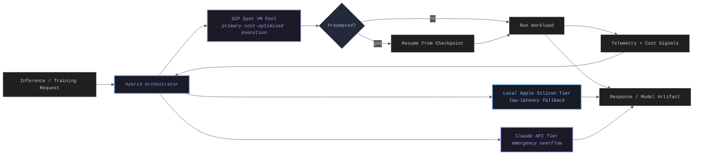
```mermaid
%%{init: {'theme': 'dark', 'themeVariables': { 'primaryColor': '#1a1b27', 'primaryTextColor': '#a9b1d6', 'lineColor': '#545c7e', 'fontSize': '13px', 'fontFamily': 'JetBrains Mono, monospace' }}}%%

flowchart LR
    REQ["Inference / Training Request"] --> ORCH["Hybrid Orchestrator"]
    ORCH --> SPOT["GCP Spot VM Pool<br/><i>primary cost-optimized execution</i>"]
    ORCH --> LOCAL["Local Apple Silicon Tier<br/><i>low-latency fallback</i>"]
    ORCH --> API["Claude API Tier<br/><i>emergency overflow</i>"]

    SPOT --> PREEMPT{"Preempted?"}
    PREEMPT -->|"no"| RUN["Run Workload"]
    PREEMPT -->|"yes"| RECOVER["Resume From Checkpoint"]
    RECOVER --> RUN

    RUN --> TELE["Telemetry + Cost Signals"]
    TELE --> ORCH
    RUN --> RES["Response / Model Artifact"]
    LOCAL --> RES
    API --> RES

    style ORCH fill:#1a1b27,stroke:#70a5fd,stroke-width:2px,color:#70a5fd
    style SPOT fill:#1a1b27,stroke:#bf91f3,stroke-width:2px,color:#bf91f3
    style LOCAL fill:#1a1b27,stroke:#7dcfff,stroke-width:2px,color:#7dcfff
    style API fill:#1a1b27,stroke:#bb9af7,stroke-width:2px,color:#bb9af7
    style PREEMPT fill:#24283b,stroke:#545c7e,stroke-width:1px,color:#a9b1d6
```

### Golden Image Architecture (Model-Ready Compute)

<details>
<summary><b>Purpose, Problem, Challenge, Solution</b></summary>
<br>

- **Purpose:** Eliminate repeated cold setup by pre-baking model runtimes and dependencies into immutable machine images.
- **Problem:** Dynamic provisioning causes long startup times, dependency drift, and inconsistent behavior across nodes.
- **Core Challenge:** Keep images reproducible and secure while continuously shipping model/runtime updates.
- **What This Solves:** Establishes an immutable golden-image pipeline with validation gates and rollout controls for consistent low-latency boot.

</details>


```mermaid
%%{init: {'theme': 'dark', 'themeVariables': { 'primaryColor': '#1a1b27', 'primaryTextColor': '#a9b1d6', 'lineColor': '#545c7e', 'fontSize': '13px', 'fontFamily': 'JetBrains Mono, monospace' }}}%%

flowchart LR
    SRC["Model + Runtime Source"] --> BUILD["Image Builder Pipeline"]
    BUILD --> BAKE["Bake Golden Image<br/><i>models + deps + startup contracts</i>"]
    BAKE --> VALIDATE["Validation Gate<br/><i>health, integrity, startup SLA</i>"]
    VALIDATE -->|"pass"| REG["Image Registry"]
    VALIDATE -->|"fail"| REJECT["Reject Build"]

    REG --> SCALE["Autoscaled GCP Inference Nodes"]
    SCALE --> PRIME["JARVIS-Prime Router"]
    PRIME --> MON["Observability + Drift Monitoring"]
    MON --> BUILD

    style BUILD fill:#1a1b27,stroke:#70a5fd,stroke-width:2px,color:#70a5fd
    style BAKE fill:#1a1b27,stroke:#bf91f3,stroke-width:2px,color:#bf91f3
    style VALIDATE fill:#1a1b27,stroke:#7dcfff,stroke-width:2px,color:#7dcfff
    style REG fill:#1a1b27,stroke:#bb9af7,stroke-width:2px,color:#bb9af7
    style REJECT fill:#1a1b27,stroke:#f7768e,stroke-width:2px,color:#f7768e
```

### Execution Planes (Control / Data / Model)

<details>
<summary><b>Purpose, Problem, Challenge, Solution</b></summary>
<br>

- **Purpose:** Separate operational concerns into control, data, and model planes for clearer ownership and safer evolution.
- **Problem:** Without plane separation, policy, state, and model behavior become tightly coupled and brittle during scale-out.
- **Core Challenge:** Enforce governance and safety globally while allowing model and data pipelines to move quickly.
- **What This Solves:** Makes architecture auditable and composable: control governs, data persists context, models execute decisions.

</details>

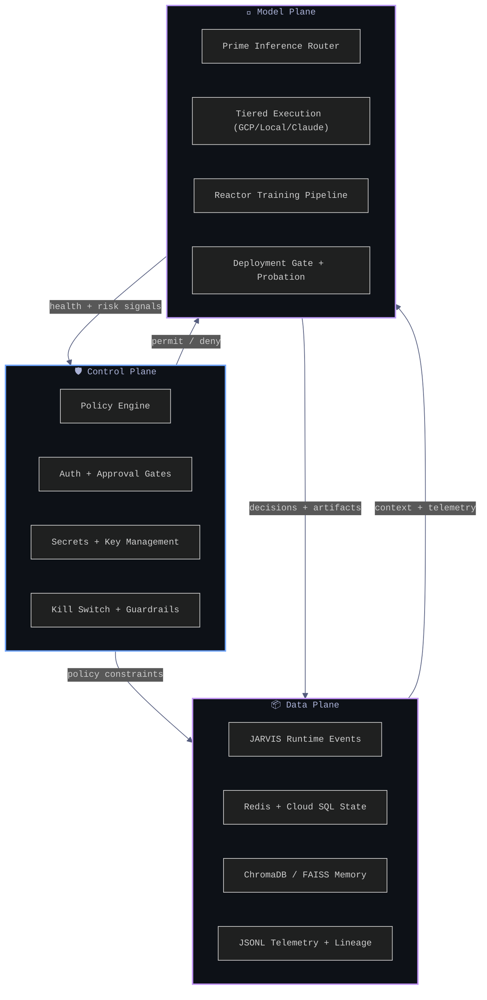
```mermaid
%%{init: {'theme': 'dark', 'themeVariables': { 'primaryColor': '#1a1b27', 'primaryTextColor': '#a9b1d6', 'lineColor': '#545c7e', 'fontSize': '13px', 'fontFamily': 'JetBrains Mono, monospace' }}}%%

flowchart TB
    subgraph CONTROL["🛡️ Control Plane"]
        C1["Policy Engine"]
        C2["Auth + Approval Gates"]
        C3["Secrets + Key Management"]
        C4["Kill Switch + Guardrails"]
    end

    subgraph DATA["📦 Data Plane"]
        D1["JARVIS Runtime Events"]
        D2["Redis + Cloud SQL State"]
        D3["ChromaDB / FAISS Memory"]
        D4["JSONL Telemetry + Lineage"]
    end

    subgraph MODEL["🧠 Model Plane"]
        M1["Prime Inference Router"]
        M2["Tiered Execution (GCP/Local/Claude)"]
        M3["Reactor Training Pipeline"]
        M4["Deployment Gate + Probation"]
    end

    CONTROL -->|"policy constraints"| DATA
    CONTROL -->|"permit / deny"| MODEL
    DATA -->|"context + telemetry"| MODEL
    MODEL -->|"decisions + artifacts"| DATA
    MODEL -->|"health + risk signals"| CONTROL

    style CONTROL fill:#0d1117,stroke:#70a5fd,stroke-width:2px,color:#a9b1d6
    style DATA fill:#0d1117,stroke:#bf91f3,stroke-width:2px,color:#a9b1d6
    style MODEL fill:#0d1117,stroke:#bb9af7,stroke-width:2px,color:#a9b1d6
```

### Memory Control Plane (UMA-Aware Resource Governance)

<details>
<summary><b>Purpose, Problem, Challenge, Solution</b></summary>
<br>

- **Purpose:** Govern shared Apple Silicon UMA memory with explicit, lease-based control across model loads, display surfaces, and agent runtime.
- **Problem:** GPU/compositor pressure is often invisible to process-level memory metrics, so systems can appear healthy while heading into swap thrash.
- **Core Challenge:** Coordinate memory decisions across heterogeneous consumers while preventing flapping and preserving critical capabilities.
- **What This Solves:** Introduces deterministic memory governance with pressure-aware lease grants, stepwise shedding, and crash-safe lease reconciliation.

</details>

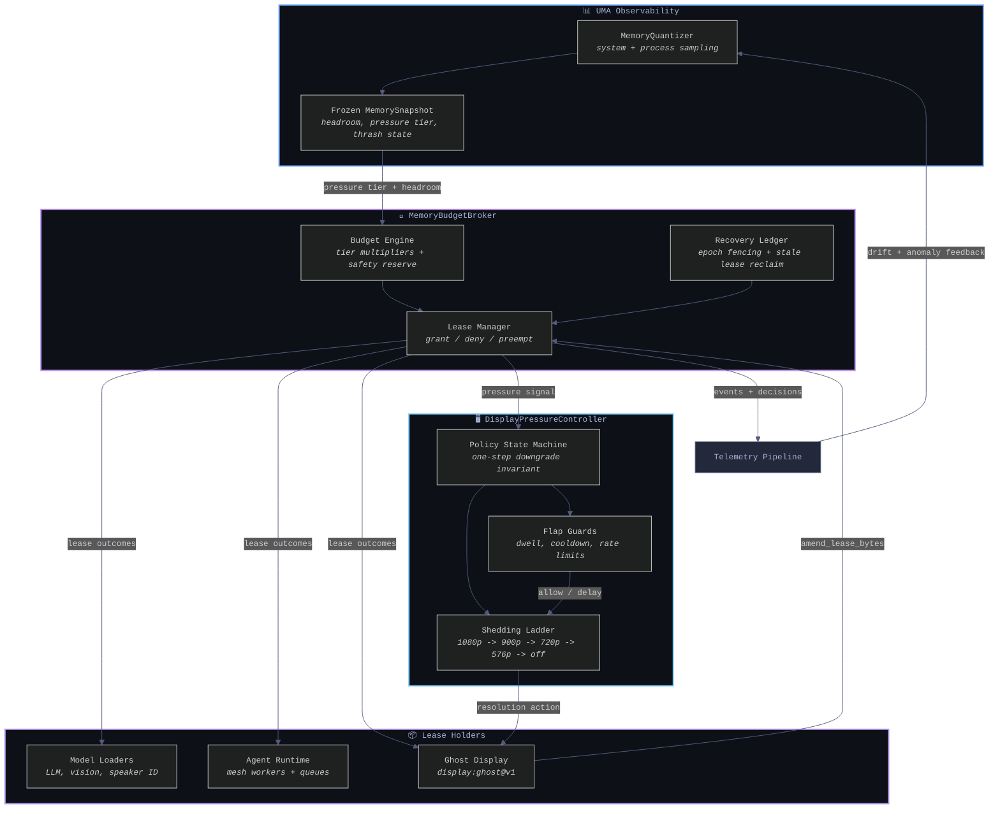
```mermaid
%%{init: {'theme': 'dark', 'themeVariables': { 'primaryColor': '#1a1b27', 'primaryTextColor': '#a9b1d6', 'primaryBorderColor': '#70a5fd', 'lineColor': '#545c7e', 'secondaryColor': '#24283b', 'tertiaryColor': '#1a1b27', 'fontSize': '13px', 'fontFamily': 'JetBrains Mono, monospace' }}}%%

flowchart TB
    subgraph OBS["📊 UMA Observability"]
        Q["MemoryQuantizer<br/><i>system + process sampling</i>"]
        S["Frozen MemorySnapshot<br/><i>headroom, pressure tier, thrash state</i>"]
        Q --> S
    end

    subgraph BROKER["🧠 MemoryBudgetBroker"]
        B1["Lease Manager<br/><i>grant / deny / preempt</i>"]
        B2["Budget Engine<br/><i>tier multipliers + safety reserve</i>"]
        B3["Recovery Ledger<br/><i>epoch fencing + stale lease reclaim</i>"]
    end

    subgraph CONSUMERS["📦 Lease Holders"]
        M["Model Loaders<br/><i>LLM, vision, speaker ID</i>"]
        A["Agent Runtime<br/><i>mesh workers + queues</i>"]
        D["Ghost Display<br/><i>display:ghost@v1</i>"]
    end

    subgraph CONTROL["🖥️ DisplayPressureController"]
        C1["Policy State Machine<br/><i>one-step downgrade invariant</i>"]
        C2["Shedding Ladder<br/><i>1080p -> 900p -> 720p -> 576p -> off</i>"]
        C3["Flap Guards<br/><i>dwell, cooldown, rate limits</i>"]
    end

    S -->|"pressure tier + headroom"| B2
    B2 --> B1
    B3 --> B1
    B1 -->|"lease outcomes"| M
    B1 -->|"lease outcomes"| A
    B1 -->|"lease outcomes"| D

    B1 -->|"pressure signal"| C1
    C1 --> C2
    C2 -->|"resolution action"| D
    C1 --> C3
    C3 -->|"allow / delay"| C2

    D -->|"amend_lease_bytes"| B1
    B1 -->|"events + decisions"| T["Telemetry Pipeline"]
    T -->|"drift + anomaly feedback"| Q

    style OBS fill:#0d1117,stroke:#70a5fd,stroke-width:2px,color:#a9b1d6
    style BROKER fill:#0d1117,stroke:#bf91f3,stroke-width:2px,color:#a9b1d6
    style CONSUMERS fill:#0d1117,stroke:#bb9af7,stroke-width:2px,color:#a9b1d6
    style CONTROL fill:#0d1117,stroke:#7dcfff,stroke-width:2px,color:#a9b1d6
    style T fill:#24283b,stroke:#545c7e,stroke-width:1px,color:#a9b1d6
```

<details>
<summary><b>Key design decisions</b></summary>
<br>

- **Lease-first memory policy** — Components must request memory leases before expensive allocations; brokered leases are the source of truth.
- **Typed pressure tiers** — Budget aggressiveness changes by pressure tier to avoid hardcoded, brittle thresholds.
- **Deterministic shedding** — Display degradation follows ordered one-step transitions, preventing abrupt multi-level drops.
- **Flap prevention controls** — Dwell windows, cooldowns, and rate limits stop oscillation under noisy pressure signals.
- **Crash-safe reconciliation** — Epoch fencing and stale lease recovery reclaim orphaned allocations after process failures.
- **Closed-loop observability** — Broker and controller events feed telemetry so memory policy can be calibrated over time.

</details>

### Safety & Governance Path

<details>
<summary><b>Purpose, Problem, Challenge, Solution</b></summary>
<br>

- **Purpose:** Document the decision policy from risk classification to approval, execution, blocking, and audit.
- **Problem:** Autonomous systems can perform high-impact actions where incorrect execution is costly or irreversible.
- **Core Challenge:** Balance autonomy and velocity with explicit human control boundaries for high-risk operations.
- **What This Solves:** Provides a predictable safety envelope: low-risk auto-exec, medium-risk constrained mode, high-risk human-in-the-loop.

</details>

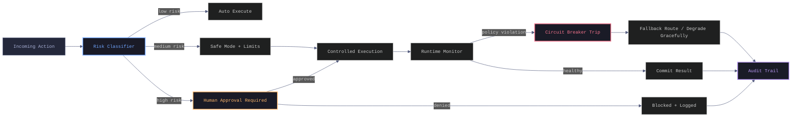
```mermaid
%%{init: {'theme': 'dark', 'themeVariables': { 'primaryColor': '#1a1b27', 'primaryTextColor': '#a9b1d6', 'lineColor': '#545c7e', 'fontSize': '13px', 'fontFamily': 'JetBrains Mono, monospace' }}}%%

flowchart LR
    IN["Incoming Action"] --> CLASS["Risk Classifier"]
    CLASS -->|"low risk"| AUTO["Auto Execute"]
    CLASS -->|"medium risk"| SAFE["Safe Mode + Limits"]
    CLASS -->|"high risk"| HITL["Human Approval Required"]

    SAFE --> EXEC["Controlled Execution"]
    HITL -->|"approved"| EXEC
    HITL -->|"denied"| BLOCK["Blocked + Logged"]

    EXEC --> MON["Runtime Monitor"]
    MON -->|"policy violation"| TRIP["Circuit Breaker Trip"]
    TRIP --> FB["Fallback Route / Degrade Gracefully"]
    MON -->|"healthy"| OK["Commit Result"]

    BLOCK --> AUD["Audit Trail"]
    FB --> AUD
    OK --> AUD

    style IN fill:#24283b,stroke:#545c7e,stroke-width:1px,color:#a9b1d6
    style CLASS fill:#1a1b27,stroke:#70a5fd,stroke-width:2px,color:#70a5fd
    style HITL fill:#1a1b27,stroke:#ffb86c,stroke-width:2px,color:#ffb86c
    style TRIP fill:#1a1b27,stroke:#f7768e,stroke-width:2px,color:#f7768e
    style AUD fill:#1a1b27,stroke:#bb9af7,stroke-width:2px,color:#bb9af7
```

### Observability & Closed-Loop Learning

<details>
<summary><b>Purpose, Problem, Challenge, Solution</b></summary>
<br>

- **Purpose:** Show how runtime signals become training data, deployment decisions, and measurable model upgrades.
- **Problem:** Teams often collect telemetry but fail to operationalize it into safe, repeatable improvement cycles.
- **Core Challenge:** Detect regressions early, gate bad models, and continuously retrain without destabilizing production.
- **What This Solves:** Establishes a true learning loop: observe -> detect -> curate -> train -> gate/probation -> deploy or rollback.

</details>

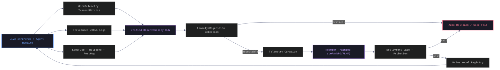
```mermaid
%%{init: {'theme': 'dark', 'themeVariables': { 'primaryColor': '#1a1b27', 'primaryTextColor': '#a9b1d6', 'lineColor': '#545c7e', 'fontSize': '13px', 'fontFamily': 'JetBrains Mono, monospace' }}}%%

flowchart LR
    RUN["Live Inference + Agent Runtime"] --> OTEL["OpenTelemetry Traces/Metrics"]
    RUN --> LOGS["Structured JSONL Logs"]
    RUN --> COST["LangFuse + Helicone + PostHog"]

    OTEL --> HUB["Unified Observability Hub"]
    LOGS --> HUB
    COST --> HUB

    HUB --> ALERT["Anomaly/Regression Detection"]
    ALERT -->|"critical"| ROLLBACK["Auto Rollback / Gate Fail"]
    ALERT -->|"acceptable"| CURATE["Telemetry Curation"]

    CURATE --> TRAIN["Reactor Training (LoRA/DPO/RLHF)"]
    TRAIN --> GATE["Deployment Gate + Probation"]
    GATE -->|"pass"| PRIME["Prime Model Registry"]
    GATE -->|"fail"| ROLLBACK

    PRIME --> RUN

    style RUN fill:#1a1b27,stroke:#70a5fd,stroke-width:2px,color:#70a5fd
    style HUB fill:#1a1b27,stroke:#bf91f3,stroke-width:2px,color:#bf91f3
    style TRAIN fill:#1a1b27,stroke:#bb9af7,stroke-width:2px,color:#bb9af7
    style ROLLBACK fill:#1a1b27,stroke:#f7768e,stroke-width:2px,color:#f7768e
```

---

<div align="center">

### Repository Breakdown

<table>
<tr>
<td align="center" width="33%">

<a href="https://github.com/drussell23/JARVIS">

</a>
<br><br>

<br><br>
<b>Port 8010</b><br>
60+ Agent Neural Mesh<br>
Voice Biometrics<br>
Ghost Display + Vision<br>
macOS Native (203 Swift files)<br>
RAG + Ouroboros Self-Programming

</td>
<td align="center" width="33%">

<a href="https://github.com/drussell23/JARVIS-Prime">

</a>
<br><br>

<br><br>
<b>Port 8000-8001</b><br>
11 Specialist GGUF Models (40.4 GB)<br>
Task-Type Inference Routing<br>
LLaVA Vision Server<br>
CoT/ToT Reasoning Engine<br>
Neural Switchboard v98.1

</td>
<td align="center" width="33%">

<a href="https://github.com/drussell23/JARVIS-Reactor">

</a>
<br><br>

<br><br>
<b>Port 8090</b><br>
LoRA / DPO / RLHF Training<br>
Deployment Gate + Probation<br>
Model Lineage Tracking<br>
GCP Spot VM Auto-Recovery<br>
Native C++ Training Kernels

</td>
</tr>
</table>

</div>

---

###  &nbsp; Deep Dive

<details>
<summary><b>Agent Architecture</b></summary>
<br>

- **Neural Mesh** — 16+ specialized agents (activity recognition, adaptive resource governor, context tracker, error analyzer, goal inference, Google Workspace, health monitor, memory, pattern recognition, predictive planning, spatial awareness, visual monitor, web search, coordinator) with asynchronous message passing, capability-based routing, and cross-agent data flow
- **Autonomous Agent Runtime** — multi-step goal decomposition, agentic task execution, tool orchestration, error recovery, and intervention decision engine with human-in-the-loop approval for destructive actions
- **AGI OS Coordinator** — proactive event stream, notification bridge, owner identity service, voice approval manager, and intelligent startup announcer

</details>

<details>
<summary><b>Voice and Authentication</b></summary>
<br>

- **Real-time voice biometric authentication** via ECAPA-TDNN speaker verification with cloud/local hybrid inference and multi-factor fusion (voice + proximity + behavioral)
- **Real-time voice conversation** — full-duplex audio (simultaneous mic + speaker), acoustic echo cancellation (speexdsp), streaming STT (faster-whisper), adaptive turn detection, barge-in control, and sliding 20-turn context window
- **Wake word detection** (Porcupine/Picovoice), Apple Watch Bluetooth proximity auth, continuous learning voice profiles
- **Unified speech state management** — STT hallucination guard, voice pipeline orchestration, parallel model loading

</details>

<details>
<summary><b>Vision and Spatial Intelligence</b></summary>
<br>

- **Never-skip screen capture** — two-phase monitoring (always-capture + conditional-analysis), self-hosted LLaVA multimodal analysis, Claude Vision escalation
- **Ghost Display** — virtual macOS display for non-intrusive background automation, Ghost Hands orchestrator for autonomous visual workflows
- **Claude Computer Use** — automated mouse, keyboard, and screenshot interaction via Anthropic's Computer Use API
- **OCR / OmniParser** — screen text extraction, window analysis, workspace name detection, multi-monitor and multi-space intelligence via yabai window manager
- **YOLO + Claude hybrid vision** — object detection with LLM-powered semantic understanding
- **Rust vision core** — native performance for fast image processing, bloom filter networks, and sliding window analysis

</details>

<details>
<summary><b>macOS Native Integration (Swift / Objective-C / Rust)</b></summary>
<br>

- **Swift bridge** (203 files) — CommandClassifier, SystemControl (preferences, security, clipboard, filesystem), PerformanceCore, ScreenCapture, WeatherKit, CoreLocation GPS
- **Objective-C voice unlock daemon** — JARVISVoiceAuthenticator, JARVISVoiceMonitor, permission manager, launchd service integration
- **Rust performance layer** — PyO3 bindings for memory pool management, quantized ML inference, vision fast processor, command classifier, health predictor; ARM64 SIMD assembly optimizations
- **CoreML acceleration** — on-device intent classification, voice processing

</details>

<details>
<summary><b>Infrastructure and Reliability</b></summary>
<br>

- **Parallel initializer** with cooperative cancellation, adaptive EMA-based deadlines, dependency propagation, and atomic state persistence
- **CPU-pressure-aware cloud shifting** — automatic workload offload to GCP when local resources are constrained
- **Enterprise hardening** — dependency injection container, enterprise process manager, system hardening, governance, Cloud SQL with race-condition-proof proxy management, TLS-safe connection factories, distributed lock manager
- **Three-tier inference routing**: GCP Golden Image (primary) → Local Apple Silicon (fallback) → Claude API (emergency)
- **Trinity event bus** — cross-repo IPC hub, heartbeat publishing, knowledge graph, state management, process coordination
- **Cost tracking and rate limiting** — GCP cost optimization with Bayesian confidence fusion, intelligent rate orchestration
- **File integrity guardian** — pre-commit integrity verification across the codebase

</details>

<details>
<summary><b>Intelligence and Learning</b></summary>
<br>

- **Google Workspace Agent** — Gmail read/search/draft, Google Calendar, natural language intent routing via tiered command router
- **Proactive intelligence** — predictive suggestions, proactive vision monitoring, proactive communication, emotional intelligence module
- **RAG pipeline** — ChromaDB vector store, FAISS similarity search, embedding service, long-term memory system
- **Chain-of-thought / reasoning graph engine** — LangGraph-based multi-step reasoning with conditional routing and reflection loops
- **Ouroboros + Venom + Trinity Consciousness (A grade, Claude Code-level)** — 6-layer autonomous self-development organism: **Strategic Direction** (Manifesto principles → every prompt) + **Consciousness** (7 engines, ChromaDB learning, regression prediction) + **Event Spine** (15 sensors, <1s reactions, 3 bus bridges) + **Ouroboros Pipeline** (2 parallel workers, adaptive DW→Claude cascade) + **Venom** (100+ bash, web search, run_tests, DW real-time + Claude tool loops, L2 repair) + **6-Layer Cost Optimization** (DW real-time 30x cheaper, Claude prompt caching 90%, smart max_tokens, prompt compression, complexity routing — **50-150+ ops per $0.50**) + Rich TUI + signed commits
- **Web research service** — autonomous web search and information synthesis
- **A/B testing framework** — vision pipeline experimentation
- **Repository intelligence** — code ownership analysis, dependency analyzer, API contract analyzer, AST transformer, cross-repo refactoring engine

</details>

###  &nbsp; Deep Dive

<details>
<summary><b>Inference and Routing</b></summary>
<br>

- **11 specialist GGUF models** (~40.4 GB) pre-baked into a GCP golden image with ~30-second cold starts
- **Task-type routing** — math queries hit Qwen2.5-7B, code queries hit DeepCoder, simple queries hit a 2.2 GB fast model, vision hits LLaVA
- **GCP Model Swap Coordinator** with intelligent hot-swapping, per-model configuration, and inference validation
- **Neural Switchboard v98.1** — stable public API facade over routing and orchestration with WebSocket integration contracts
- **Hollow Client mode** for memory-constrained hardware — strict lazy imports, zero ML dependencies at startup on 16 GB machines

</details>

<details>
<summary><b>Reasoning and Telemetry</b></summary>
<br>

- **Continuous learning hook** — post-inference experience recording for Elastic Weight Consolidation via ReactorCore
- **Reasoning engine activation** — chain-of-thought scaffolding (CoT/ToT/self-reflection) for high-complexity requests above configurable thresholds
- **APARS protocol** (Adaptive Progress-Aware Readiness System) — 6-phase startup with real-time health reporting to the supervisor
- **LLaVA vision server** — multimodal inference on port 8001 with OpenAI-compatible API, semaphore serialization, queue depth cap
- **Telemetry capture** — structured JSONL interaction logging with deployment feedback loop and post-deployment probation monitoring

</details>

###  &nbsp; Deep Dive

<details>
<summary><b>Training Pipeline</b></summary>
<br>

- **Full training pipeline**: telemetry ingestion → active learning selection → gatekeeper evaluation → LoRA SFT → GGUF export → deployment gate → probation monitoring → feedback loop
- **DeploymentGate** validates model integrity before deployment; rejects corrupt or degenerate outputs
- **Post-deployment probation** — 30-minute health monitoring window with automatic commit or rollback based on live inference quality
- **Model lineage tracking** — full provenance chain (hash, parent model, training method, evaluation scores, gate decision) in append-only JSONL
- **Tier-2/Tier-3 runtime orchestration** — curriculum learning, meta-learning (MAML), causal discovery with correlation-based fallback, world model training

</details>

<details>
<summary><b>Infrastructure and Integration</b></summary>
<br>

- **GCP Spot VM auto-recovery** with training checkpoint persistence and 60% cost reduction over on-demand instances
- **Native C++ training kernels** via CMake/pybind11/cpp-httplib for performance-critical operations
- **Atomic experience snapshots** — buffer drain under async lock, JSONL with DataHash for dataset versioning
- **PrimeConnector** — WebSocket path rotation, health polling fallback, contract path discovery for cross-repo communication
- **Cross-repo integration** — Ghost Display state reader, cloud mode detection, Trinity Unified Loop Manager, pipeline event logger with correlation IDs

</details>

---

## Technical Footprint

| Metric | Value |
|--------|-------|
| **Total commits** | 3,900+ across 3 repositories |
| **Codebase** | ~2.5 million lines across 18+ languages |
| **Build duration** | 12 months, solo |
| **Unified kernel** | 50,000+ lines in a single orchestration file |
| **Neural Mesh agents** | 16+ specialized agents with async message passing |
| **Models served** | 11 specialist GGUF models via task-type routing |
| **Inference tiers** | GCP Golden Image → Local Metal GPU → Claude API |
| **Training pipeline** | Automated: telemetry → active learning → gatekeeper → training → GGUF export → deployment gate → probation → feedback |
| **Voice auth** | Multi-factor: ECAPA-TDNN biometric + Apple Watch proximity + behavioral analysis |
| **Vision pipeline** | Never-skip capture, LLaVA self-hosted, Claude escalation, YOLO hybrid, OCR/OmniParser |
| **Swift components** | 203 files — system control, command classifier, screen capture, GPS, weather |
| **Rust crates** | 5 Cargo workspaces — memory pool, vision processor, ML inference, SIMD optimizations |
| **Terraform modules** | 7 modules (compute, network, security, storage, monitoring, budget, Spot templates) |
| **Dockerfiles** | 6 (backend, backend-slim, frontend, training, cloud, GCP inference) |
| **GitHub Actions** | 20+ workflows (CI/CD, CodeQL, e2e testing, deployment, database validation, file integrity) |
| **macOS integration** | Native Swift/ObjC daemons, yabai WM, Ghost Display, multi-space/multi-monitor, launchd services |
| **Cloud infrastructure** | GCP (Compute Engine, Cloud SQL, Cloud Run, Secret Manager, Monitoring), Spot VM auto-recovery |
| **Google Workspace** | Gmail read/search/draft, Calendar, natural language routing via tiered command router |

---

## Background

I graduated from Cal Poly San Luis Obispo with a B.S. in Computer Engineering after a [10-year non-traditional academic path](https://mustangnews.net/10-years-in-the-making-one-cal-poly-students-unique-path-to-an-engineering-degree/) that started in remedial algebra at community college. I retook courses, studied through the loss of family, and spent most of my twenties earning a degree that others finish in four years. The path was not conventional. The outcome was.

JARVIS is what happens when that level of persistence meets engineering capability. Twelve months of daily commits, architectural decisions at every layer of the stack, and a refusal to ship anything that is not production-grade.

---

<div align="center">

[](https://www.linkedin.com/in/derek-j-russell/)
[](https://mustangnews.net/10-years-in-the-making-one-cal-poly-students-unique-path-to-an-engineering-degree/)

</div>


