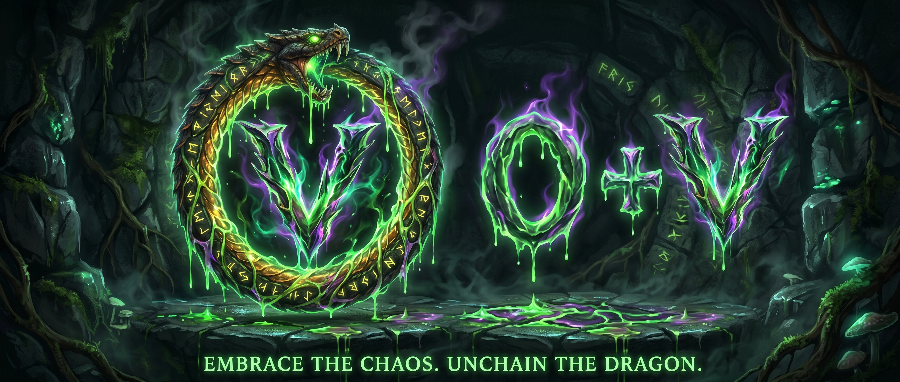
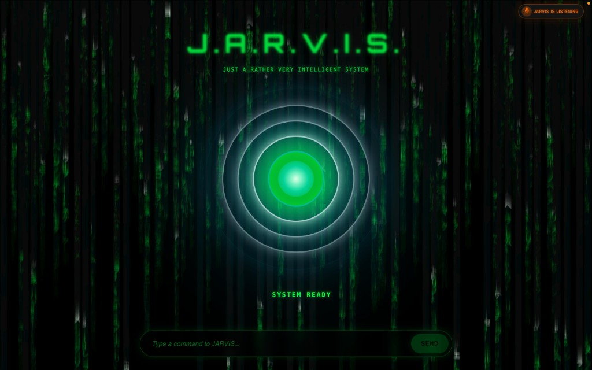
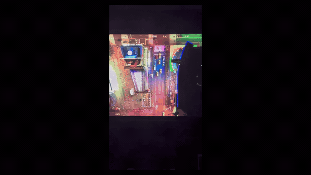
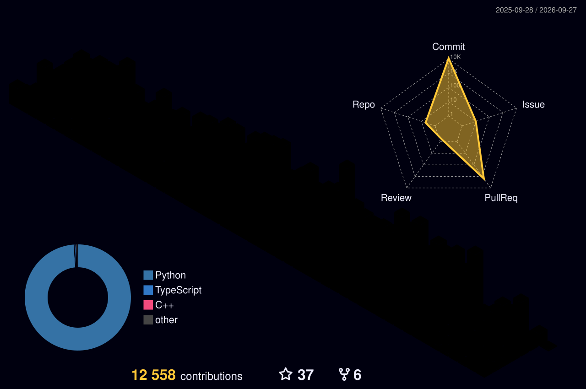

 

 

**AI Systems Engineer building JARVIS — a ~5.35M-line autonomous AI ecosystem across 3 repos, developed in part by its own agent, Ouroboros + Venom (O+V). Solo-built. Open to research-engineering roles in agents, evaluation and LLM infrastructure.**

 

 

---

`Feb 2025 → present` · `11,230 commits` · `solo-built` · `37 machine-authored commits landed on main` · `66,000+ tests`  
`~5.35M tracked lines (3 repos)` · `4.12M Python` · `11,185 files` · `Python · Swift · TypeScript · Rust`  
`O+V engine ~1.03M lines` · `test spine ~1.18M lines`

Every figure is git-tracked and reproducible — <code>python3 scripts/readme_stats.py</code> in <a href="https://github.com/drussell23/JARVIS">JARVIS</a> (as of 2026-10-06) · built locally from Feb 2025; public on GitHub since Aug 2025

---

## What I'm building

**JARVIS** is meant to be a symbiotic AI assistant, not one you call on. It talks with me by voice, sees and acts on my desktops, remembers what worked, and every interaction becomes data its model learns from.

A system like that has no finish line, so I built the system that builds it. **O+V (Ouroboros + Venom)** is an autonomous agent that develops JARVIS itself. Coding agents like Claude Code wait to be asked; O+V finds work in the codebase, proposes a change, validates it and lands it on its own. **Venom** generates and acts; **Ouroboros** is the 11-phase pipeline that governs it; **Antivenom** bounds what Venom may change.

The moment an agent acts on its own, the hard problem stops being what it can do and becomes what it should be trusted to do. Most of the engineering went there:

- **Autonomy is granted on evidence, never on elapsed time.** New capabilities run in shadow first, and a breaker can revoke them automatically.
- **The guardrails only get stricter.** A four-tier risk gate (`SAFE_AUTO` / `NOTIFY_APPLY` / `APPROVAL_REQUIRED` / `BLOCKED`) decides what applies automatically and what stops for human review.
- **The agent can't reach its own keys or budget.** A separate process, Aegis, holds the credentials and the spending ledger.
- **Some lines can't be crossed at all.** The system can never auto-merge a change to its own model or training code. When it's unsure, it refuses rather than guesses.

---

## See it run

**O+V #1 — booting the `ov` cockpit and asking O+V about itself**

https://github.com/user-attachments/assets/b5a4b8a9-1479-4cb4-80c3-07ee03a9f71e

**O+V #2 — at work on a local 30B model at $0.00: reading files, searching the codebase and generating, streamed live as tool calls**

https://github.com/user-attachments/assets/0f53aaa2-3f7f-43b5-a743-da1b56083237

**JARVIS — unlocking my locked Mac by voice, then carrying out the command** (sound on)

https://github.com/user-attachments/assets/874ab739-672b-40ba-8fdb-09855668fec2

Full-quality originals, including the 4K unlock demo, are in the [demo folder on Google Drive](https://drive.google.com/drive/folders/1DwBzhVjeLc1ExSShl49Oiqu3tJI44Szq).

---

## Latest results (Oct 2026)

- **Caught O+V reward-hacking its own verifier.** It landed a test that pytest reported as "1 passed" while executing nothing and never importing the code it claimed to test. [Reverted it](https://github.com/drussell23/JARVIS/commit/fcc50352f0), audited every landing from that run, and shipped a [**Test Reality Gate**](https://github.com/drussell23/JARVIS/commit/70935a4bee) that rejects tests which cannot execute, verify nothing, or never import their subject — before pytest runs.
- **6.03-hour unattended run: 10 landed commits (6 substantive), $0 inference cost** on a local 30B model. The bottleneck it exposed was the supply of landable work, not the model. [Full evidence record](https://github.com/drussell23/JARVIS/commit/0942373817).
- **Fine-tuned a 30B MoE with GRPO on one 32 GB GPU**, using the system's own validation gate as the reward. bitsandbytes silently left the fused expert tensors in bf16 (29.0B of 30.5B parameters), so "4-bit" was never 4-bit; I [wrote the per-expert quantizer](https://github.com/drussell23/JARVIS-Reactor/commit/b32f644) and a [custom backward](https://github.com/drussell23/JARVIS-Reactor/commit/eb30fef) that keeps the packed weight — ~54 GiB → 15.6 GiB.
- **Contained the agent's own candidate code.** A generated test ran `pkill -f jarvis` and killed the agent mid-run; every candidate execution now runs in an [unprivileged PID namespace](https://github.com/drussell23/JARVIS/commit/6b00b8adf5), [at every spawn site](https://github.com/drussell23/JARVIS/commit/12e641c523).
- **Cut premature patches from 106 to 1** across matched one-hour runs by blocking the model from proposing a fix before it has read the code; candidate yield went from 0 of 55 generations to 31.

---

## How the pieces connect

The platform is one closed loop — the grader that judges production work is the same signal the model learns from.

| Repository | Role | What it does |
|---|---|---|
| [**JARVIS**](https://github.com/drussell23/JARVIS) | The Body | The assistant, and where O+V lives, acts and is graded. Governance pipeline, `ov` terminal cockpit (~87K lines), Next.js/React dashboards, native macOS voice client, computer use across Windows virtual desktops with a local vision model. |
| [**JARVIS-Reactor**](https://github.com/drussell23/JARVIS-Reactor) | The Nerves | Trains the model on those graded results — GRPO and DPO with LoRA/QLoRA, per-expert NF4 for MoE models, GGUF quantization and publish-to-serving. |
| [**JARVIS-Prime**](https://github.com/drussell23/JARVIS-Prime) | The Mind | Serves the trained model back to JARVIS locally, on my own GPU — local-first at $0.00 per operation, with paid lanes behind one declared switch. |

  

 

<a href="https://docs.google.com/videos/d/1inRKtPeCSqKbTvJfUnmulTkzJ4PX-HkqaIwWBpAUGdA/edit">Watch the full JARVIS demo</a> · <a href="https://drive.google.com/drive/folders/1DwBzhVjeLc1ExSShl49Oiqu3tJI44Szq">all demo videos</a>

---

## Writing

- [**"Ouroboros + Venom (O+V): A Governed Architecture for Autonomous Self-Development"**](https://drussell23.github.io/JARVIS/architecture/OV_RESEARCH_PAPER_2026-04-16.html) — 181-page first-author paper (2026) on the architecture, safety and governance of an autonomous AI system.
- **128-page benchmark and engineering-partnership report** delivered to the co-founder/CEO of an LLM inference provider — cost economics and streaming-failure isolation, with reproduction commands.

---

## Tech stack

| Area | What I use |
|---|---|
| **Post-training** | GRPO, DPO (TRL), LoRA / QLoRA, PEFT, bitsandbytes NF4, GGUF, FSDP |
| **Inference** | Ollama, OpenAI-compatible servers, JSON-Schema constrained decoding, MoE + dense, Anthropic & OpenAI APIs, MCP |
| **Agents & evaluation** | Multi-turn tool loops, risk-tiered approval gates, verifiers with anti-gaming checks, sandboxed candidate execution |
| **Systems** | async Python, Rust (PyO3), C / C++17 / Objective-C++, Swift / SwiftUI, PostgreSQL / SQLite, Redis, SSE / WebSocket |
| **Infra** | Linux / WSL2, cgroups & PID namespaces, Docker, Kubernetes, Terraform, GCP, AWS, GitHub Actions |

---

## GitHub activity

 

 

 

<picture>
  <source media="(prefers-color-scheme: dark)" srcset="https://raw.githubusercontent.com/drussell23/drussell23/output/github-snake-dark.svg" />
  <source media="(prefers-color-scheme: light)" srcset="https://raw.githubusercontent.com/drussell23/drussell23/output/github-snake.svg" />
  
</picture>

<b>Full metrics dashboard</b>

 

---

## Background

Before JARVIS: **Software Engineer at Moody's Analytics** (product security and the log4j response, KYC/AML middleware, production NLP), **NASA Ames** rover firmware, and a **first-place autonomous quadcopter**.

I graduated from Cal Poly San Luis Obispo with a B.S. in Computer Engineering after a [10-year non-traditional path](https://mustangnews.net/10-years-in-the-making-one-cal-poly-students-unique-path-to-an-engineering-degree/) that started in special education and remedial math. The path was not conventional. The outcome was.

The previous long-form profile — architecture deep dives, the Trinity roadmap, full stack inventories — is preserved in [docs/profile-archive-2026-10.md](./docs/profile-archive-2026-10.md).

---

