 

 

---

> *I design, build, and deploy production-grade AI ecosystems from bare metal to cloud inference.*
> *My work sits at the intersection of systems engineering, machine learning infrastructure, and real-time intelligent automation.*

For the past 12 months, I have been executing a solo build of **JARVIS** — a three-repository, multi-process autonomous AI operating system spanning Python, C++, Rust, Swift, Objective-C, and TypeScript. The system orchestrates 60+ asynchronous agents across a neural mesh, routes inference dynamically between local Apple Silicon and GCP, performs real-time voice biometric authentication, controls macOS at the native API level, and continuously trains its own models through a self-improving feedback loop.

---

##  Tech Stack

#### Languages

#### ML, Inference and Data

#### Infrastructure and Cloud

#### Backend and Frontend

<b>Full Stack Inventory (text)</b>

 

| Category | Technologies |
|----------|-------------|
| **Languages** | Python, C++, Rust, Swift, Objective-C, TypeScript, JavaScript, SQL, Shell/Bash, AppleScript, HTML/CSS, ARM64 Assembly |
| **ML / Inference** | PyTorch, Transformers, llama.cpp, llama-cpp-python, GGUF quantization, ONNX Runtime, CoreML Tools, SpeechBrain, scikit-learn, SentenceTransformers, HuggingFace Hub, safetensors, tiktoken, Numba (JIT), sympy, LangChain, YOLO |
| **Training** | LoRA, DPO, RLHF, FSDP, MAML (meta-learning), curriculum learning, federated learning, causal reasoning, world model training, online learning, active learning, EWC |
| **Models / Vision** | LLaVA (multimodal), ECAPA-TDNN (speaker verification), Whisper (faster-whisper, openai-whisper), Porcupine/Picovoice (wake word), Piper TTS, OmniParser (OCR) |
| **LLM APIs** | Anthropic Claude API (chat, vision, computer use), OpenAI API (chat completions, embeddings) |
| **Rust** | PyO3, ndarray, rayon, parking_lot, DashMap, crossbeam, serde, mimalloc, image crate, ARM64 SIMD |
| **Swift / macOS** | Swift Package Manager, CoreLocation, WeatherKit, AppKit, Foundation, Quartz/CoreGraphics, Accessibility API, AVFoundation, pyobjc, launchd, osascript, yabai |
| **Vector / Data** | ChromaDB, FAISS, Redis, PostgreSQL (asyncpg, psycopg2), SQLite (aiosqlite), NetworkX, bloom filters |
| **Infrastructure** | GCP (Compute Engine, Cloud SQL, Cloud Run, Secret Manager, Monitoring), Docker, docker-compose, Terraform, Kubernetes, systemd, CMake, pybind11, cpp-httplib |
| **CI/CD** | GitHub Actions (20+ workflows), git worktrees |
| **Backend** | FastAPI, uvicorn, uvloop, gRPC, Protobuf, asyncio, aiohttp, httpx, WebSocket, Cloud SQL Proxy, circuit breakers, exponential backoff, distributed locks, epoch fencing |
| **Observability** | OpenTelemetry (tracing + metrics + OTLP/gRPC export), structlog, psutil, Pydantic, JSONL telemetry pipeline |
| **Frontend** | React 19, Next.js, Framer Motion, Axios, WebSocket real-time streaming |
| **Audio / Vision** | OpenCV, sounddevice, PyAudio, webrtcvad (VAD), speexdsp (AEC), librosa, pyautogui |

---

##  Demo

  

---

##  GitHub Stats

 

 

<picture>
  <source media="(prefers-color-scheme: dark)" srcset="https://raw.githubusercontent.com/drussell23/drussell23/output/github-snake-dark.svg" />
  <source media="(prefers-color-scheme: light)" srcset="https://raw.githubusercontent.com/drussell23/drussell23/output/github-snake.svg" />
  
</picture>

---

##  The JARVIS Ecosystem

JARVIS is not a chatbot wrapper. It is a distributed AI operating system composed of three interdependent repositories — each a standalone production system, together forming a self-improving autonomous intelligence.

### System Architecture

```mermaid
%%{init: {'theme': 'dark', 'themeVariables': { 'primaryColor': '#1a1b27', 'primaryTextColor': '#a9b1d6', 'primaryBorderColor': '#70a5fd', 'lineColor': '#545c7e', 'secondaryColor': '#24283b', 'tertiaryColor': '#1a1b27', 'fontSize': '14px', 'fontFamily': 'JetBrains Mono, monospace' }}}%%

flowchart TD
    KERNEL["<b>UNIFIED SUPERVISOR KERNEL</b><br/>Single Entry Point · 50K+ LOC<br/>7-Zone Parallel Initialization"]

    KERNEL -->|"orchestrates"| JARVIS
    KERNEL -->|"routes inference"| PRIME
    KERNEL -->|"triggers training"| REACTOR

    subgraph JARVIS["<b>JARVIS — The Body</b> &nbsp; Python / Rust / Swift &nbsp; :8010"]
        direction TB
        J1["🕸️ Neural Mesh<br/><i>16+ async agents · capability routing</i>"]
        J2["🎙️ Voice & Auth<br/><i>ECAPA-TDNN · full-duplex · wake word</i>"]
        J3["👁️ Vision & Spatial<br/><i>LLaVA · YOLO · Ghost Display · OCR</i>"]
        J4["🍎 macOS Native<br/><i>Swift 203 files · ObjC · Rust · CoreML</i>"]
        J5["🧠 Intelligence<br/><i>RAG · Ouroboros · Google Workspace</i>"]
    end

    subgraph PRIME["<b>JARVIS-Prime — The Mind</b> &nbsp; Python / GGUF &nbsp; :8000-8001"]
        direction TB
        P1["📡 Task-Type Router<br/><i>11 specialist models · 40.4 GB</i>"]
        P2["⚡ Neural Switchboard<br/><i>v98.1 · WebSocket contracts</i>"]
        P3["👁️ LLaVA Vision Server<br/><i>multimodal · OpenAI-compatible API</i>"]
        P4["💭 Reasoning Engine<br/><i>CoT / ToT / self-reflection</i>"]
        P5["📊 Telemetry Capture<br/><i>JSONL · deployment feedback loop</i>"]
    end

    subgraph REACTOR["<b>ReactorCore — The Forge</b> &nbsp; C++ / Python &nbsp; :8090"]
        direction TB
        R1["🔥 Training Pipeline<br/><i>LoRA · DPO · RLHF · FSDP</i>"]
        R2["🚪 Deployment Gate<br/><i>integrity validation · probation monitor</i>"]
        R3["🧬 Model Lineage<br/><i>full provenance chain · append-only JSONL</i>"]
        R4["☁️ GCP Spot Recovery<br/><i>checkpoint persistence · 60% cost savings</i>"]
        R5["⚙️ C++ Kernels<br/><i>CMake · pybind11 · native performance</i>"]
    end

    PRIME -.->|"telemetry + experiences"| REACTOR
    REACTOR -.->|"improved GGUF models"| PRIME
    JARVIS <-.->|"inference requests / responses"| PRIME
    REACTOR -.->|"training signals"| JARVIS

    style KERNEL fill:#1a1b27,stroke:#70a5fd,stroke-width:2px,color:#70a5fd
    style JARVIS fill:#0d1117,stroke:#70a5fd,stroke-width:2px,color:#a9b1d6
    style PRIME fill:#0d1117,stroke:#bf91f3,stroke-width:2px,color:#a9b1d6
    style REACTOR fill:#0d1117,stroke:#bb9af7,stroke-width:2px,color:#a9b1d6
```

### Data Flow

```mermaid
%%{init: {'theme': 'dark', 'themeVariables': { 'primaryColor': '#1a1b27', 'primaryTextColor': '#a9b1d6', 'lineColor': '#545c7e', 'fontSize': '13px', 'fontFamily': 'JetBrains Mono, monospace' }}}%%

flowchart LR
    A["🎤 Voice Input"] --> B["JARVIS Kernel"]
    C["👁️ Screen Capture"] --> B
    D["⌨️ User Command"] --> B
    B --> E["JARVIS-Prime<br/><i>inference routing</i>"]
    E --> F{"Task Type?"}
    F -->|"math"| G["Qwen2.5-7B"]
    F -->|"code"| H["DeepCoder"]
    F -->|"vision"| I["LLaVA"]
    F -->|"simple"| J["Fast 2.2GB"]
    F -->|"complex"| K["Claude API"]
    G & H & I & J & K --> L["Response"]
    L --> B
    E -->|"telemetry"| M["ReactorCore"]
    M -->|"LoRA/DPO training"| N["Improved Model"]
    N -->|"deploy + probation"| E

    style B fill:#1a1b27,stroke:#70a5fd,stroke-width:2px,color:#70a5fd
    style E fill:#1a1b27,stroke:#bf91f3,stroke-width:2px,color:#bf91f3
    style M fill:#1a1b27,stroke:#bb9af7,stroke-width:2px,color:#bb9af7
    style F fill:#24283b,stroke:#545c7e,stroke-width:1px,color:#a9b1d6
```

### Three-Tier Inference Routing

```mermaid
%%{init: {'theme': 'dark', 'themeVariables': { 'primaryColor': '#1a1b27', 'primaryTextColor': '#a9b1d6', 'lineColor': '#545c7e', 'fontSize': '13px', 'fontFamily': 'JetBrains Mono, monospace' }}}%%

flowchart LR
    REQ["Inference Request"] --> T1
    T1["☁️ Tier 1: GCP Golden Image<br/><i>11 models · ~30s cold start</i>"]
    T1 -->|"unavailable"| T2["💻 Tier 2: Local Apple Silicon<br/><i>M1 Metal GPU · on-device</i>"]
    T2 -->|"resource constrained"| T3["🔑 Tier 3: Claude API<br/><i>emergency fallback</i>"]
    T1 -->|"✅ success"| RES["Response"]
    T2 -->|"✅ success"| RES
    T3 -->|"✅ success"| RES

    style T1 fill:#1a1b27,stroke:#70a5fd,stroke-width:2px,color:#70a5fd
    style T2 fill:#1a1b27,stroke:#bf91f3,stroke-width:2px,color:#bf91f3
    style T3 fill:#1a1b27,stroke:#bb9af7,stroke-width:2px,color:#bb9af7
    style REQ fill:#24283b,stroke:#545c7e,stroke-width:1px,color:#a9b1d6
    style RES fill:#24283b,stroke:#545c7e,stroke-width:1px,color:#a9b1d6
```

---

### Repository Breakdown

<table>
<tr>
<td align="center" width="33%">

  

  
<b>Port 8010</b> 
60+ Agent Neural Mesh 
Voice Biometrics 
Ghost Display + Vision 
macOS Native (203 Swift files) 
RAG + Ouroboros Self-Programming

</td>
<td align="center" width="33%">

  

  
<b>Port 8000-8001</b> 
11 Specialist GGUF Models (40.4 GB) 
Task-Type Inference Routing 
LLaVA Vision Server 
CoT/ToT Reasoning Engine 
Neural Switchboard v98.1

</td>
<td align="center" width="33%">

  

  
<b>Port 8090</b> 
LoRA / DPO / RLHF Training 
Deployment Gate + Probation 
Model Lineage Tracking 
GCP Spot VM Auto-Recovery 
Native C++ Training Kernels

</td>
</tr>
</table>

---

###  &nbsp; Deep Dive

<b>Agent Architecture</b>

 

- **Neural Mesh** — 16+ specialized agents (activity recognition, adaptive resource governor, context tracker, error analyzer, goal inference, Google Workspace, health monitor, memory, pattern recognition, predictive planning, spatial awareness, visual monitor, web search, coordinator) with asynchronous message passing, capability-based routing, and cross-agent data flow
- **Autonomous Agent Runtime** — multi-step goal decomposition, agentic task execution, tool orchestration, error recovery, and intervention decision engine with human-in-the-loop approval for destructive actions
- **AGI OS Coordinator** — proactive event stream, notification bridge, owner identity service, voice approval manager, and intelligent startup announcer

<b>Voice and Authentication</b>

 

- **Real-time voice biometric authentication** via ECAPA-TDNN speaker verification with cloud/local hybrid inference and multi-factor fusion (voice + proximity + behavioral)
- **Real-time voice conversation** — full-duplex audio (simultaneous mic + speaker), acoustic echo cancellation (speexdsp), streaming STT (faster-whisper), adaptive turn detection, barge-in control, and sliding 20-turn context window
- **Wake word detection** (Porcupine/Picovoice), Apple Watch Bluetooth proximity auth, continuous learning voice profiles
- **Unified speech state management** — STT hallucination guard, voice pipeline orchestration, parallel model loading

<b>Vision and Spatial Intelligence</b>

 

- **Never-skip screen capture** — two-phase monitoring (always-capture + conditional-analysis), self-hosted LLaVA multimodal analysis, Claude Vision escalation
- **Ghost Display** — virtual macOS display for non-intrusive background automation, Ghost Hands orchestrator for autonomous visual workflows
- **Claude Computer Use** — automated mouse, keyboard, and screenshot interaction via Anthropic's Computer Use API
- **OCR / OmniParser** — screen text extraction, window analysis, workspace name detection, multi-monitor and multi-space intelligence via yabai window manager
- **YOLO + Claude hybrid vision** — object detection with LLM-powered semantic understanding
- **Rust vision core** — native performance for fast image processing, bloom filter networks, and sliding window analysis

<b>macOS Native Integration (Swift / Objective-C / Rust)</b>

 

- **Swift bridge** (203 files) — CommandClassifier, SystemControl (preferences, security, clipboard, filesystem), PerformanceCore, ScreenCapture, WeatherKit, CoreLocation GPS
- **Objective-C voice unlock daemon** — JARVISVoiceAuthenticator, JARVISVoiceMonitor, permission manager, launchd service integration
- **Rust performance layer** — PyO3 bindings for memory pool management, quantized ML inference, vision fast processor, command classifier, health predictor; ARM64 SIMD assembly optimizations
- **CoreML acceleration** — on-device intent classification, voice processing

<b>Infrastructure and Reliability</b>

 

- **Parallel initializer** with cooperative cancellation, adaptive EMA-based deadlines, dependency propagation, and atomic state persistence
- **CPU-pressure-aware cloud shifting** — automatic workload offload to GCP when local resources are constrained
- **Enterprise hardening** — dependency injection container, enterprise process manager, system hardening, governance, Cloud SQL with race-condition-proof proxy management, TLS-safe connection factories, distributed lock manager
- **Three-tier inference routing**: GCP Golden Image (primary) → Local Apple Silicon (fallback) → Claude API (emergency)
- **Trinity event bus** — cross-repo IPC hub, heartbeat publishing, knowledge graph, state management, process coordination
- **Cost tracking and rate limiting** — GCP cost optimization with Bayesian confidence fusion, intelligent rate orchestration
- **File integrity guardian** — pre-commit integrity verification across the codebase

<b>Intelligence and Learning</b>

 

- **Google Workspace Agent** — Gmail read/search/draft, Google Calendar, natural language intent routing via tiered command router
- **Proactive intelligence** — predictive suggestions, proactive vision monitoring, proactive communication, emotional intelligence module
- **RAG pipeline** — ChromaDB vector store, FAISS similarity search, embedding service, long-term memory system
- **Chain-of-thought / reasoning graph engine** — LangGraph-based multi-step reasoning with conditional routing and reflection loops
- **Ouroboros** — self-programming engine for autonomous codebase analysis and improvement
- **Web research service** — autonomous web search and information synthesis
- **A/B testing framework** — vision pipeline experimentation
- **Repository intelligence** — code ownership analysis, dependency analyzer, API contract analyzer, AST transformer, cross-repo refactoring engine

###  &nbsp; Deep Dive

<b>Inference and Routing</b>

 

- **11 specialist GGUF models** (~40.4 GB) pre-baked into a GCP golden image with ~30-second cold starts
- **Task-type routing** — math queries hit Qwen2.5-7B, code queries hit DeepCoder, simple queries hit a 2.2 GB fast model, vision hits LLaVA
- **GCP Model Swap Coordinator** with intelligent hot-swapping, per-model configuration, and inference validation
- **Neural Switchboard v98.1** — stable public API facade over routing and orchestration with WebSocket integration contracts
- **Hollow Client mode** for memory-constrained hardware — strict lazy imports, zero ML dependencies at startup on 16 GB machines

<b>Reasoning and Telemetry</b>

 

- **Continuous learning hook** — post-inference experience recording for Elastic Weight Consolidation via ReactorCore
- **Reasoning engine activation** — chain-of-thought scaffolding (CoT/ToT/self-reflection) for high-complexity requests above configurable thresholds
- **APARS protocol** (Adaptive Progress-Aware Readiness System) — 6-phase startup with real-time health reporting to the supervisor
- **LLaVA vision server** — multimodal inference on port 8001 with OpenAI-compatible API, semaphore serialization, queue depth cap
- **Telemetry capture** — structured JSONL interaction logging with deployment feedback loop and post-deployment probation monitoring

###  &nbsp; Deep Dive

<b>Training Pipeline</b>

 

- **Full training pipeline**: telemetry ingestion → active learning selection → gatekeeper evaluation → LoRA SFT → GGUF export → deployment gate → probation monitoring → feedback loop
- **DeploymentGate** validates model integrity before deployment; rejects corrupt or degenerate outputs
- **Post-deployment probation** — 30-minute health monitoring window with automatic commit or rollback based on live inference quality
- **Model lineage tracking** — full provenance chain (hash, parent model, training method, evaluation scores, gate decision) in append-only JSONL
- **Tier-2/Tier-3 runtime orchestration** — curriculum learning, meta-learning (MAML), causal discovery with correlation-based fallback, world model training

<b>Infrastructure and Integration</b>

 

- **GCP Spot VM auto-recovery** with training checkpoint persistence and 60% cost reduction over on-demand instances
- **Native C++ training kernels** via CMake/pybind11/cpp-httplib for performance-critical operations
- **Atomic experience snapshots** — buffer drain under async lock, JSONL with DataHash for dataset versioning
- **PrimeConnector** — WebSocket path rotation, health polling fallback, contract path discovery for cross-repo communication
- **Cross-repo integration** — Ghost Display state reader, cloud mode detection, Trinity Unified Loop Manager, pipeline event logger with correlation IDs

---

## Technical Footprint

| Metric | Value |
|--------|-------|
| **Total commits** | 3,900+ across 3 repositories |
| **Codebase** | ~2.5 million lines across 11 languages |
| **Build duration** | 12 months, solo |
| **Unified kernel** | 50,000+ lines in a single orchestration file |
| **Neural Mesh agents** | 16+ specialized agents with async message passing |
| **Models served** | 11 specialist GGUF models via task-type routing |
| **Inference tiers** | GCP Golden Image → Local Metal GPU → Claude API |
| **Training pipeline** | Automated: telemetry → active learning → gatekeeper → training → GGUF export → deployment gate → probation → feedback |
| **Voice auth** | Multi-factor: ECAPA-TDNN biometric + Apple Watch proximity + behavioral analysis |
| **Vision pipeline** | Never-skip capture, LLaVA self-hosted, Claude escalation, YOLO hybrid, OCR/OmniParser |
| **Swift components** | 203 files — system control, command classifier, screen capture, GPS, weather |
| **Rust crates** | 5 Cargo workspaces — memory pool, vision processor, ML inference, SIMD optimizations |
| **Terraform modules** | 7 modules (compute, network, security, storage, monitoring, budget, Spot templates) |
| **Dockerfiles** | 6 (backend, backend-slim, frontend, training, cloud, GCP inference) |
| **GitHub Actions** | 20+ workflows (CI/CD, CodeQL, e2e testing, deployment, database validation, file integrity) |
| **macOS integration** | Native Swift/ObjC daemons, yabai WM, Ghost Display, multi-space/multi-monitor, launchd services |
| **Cloud infrastructure** | GCP (Compute Engine, Cloud SQL, Cloud Run, Secret Manager, Monitoring), Spot VM auto-recovery |
| **Google Workspace** | Gmail read/search/draft, Calendar, natural language routing via tiered command router |

---

## Background

I graduated from Cal Poly San Luis Obispo with a B.S. in Computer Engineering after a [10-year non-traditional academic path](https://mustangnews.net/10-years-in-the-making-one-cal-poly-students-unique-path-to-an-engineering-degree/) that started in remedial algebra at community college. I retook courses, studied through the loss of family, and spent most of my twenties earning a degree that others finish in four years. The path was not conventional. The outcome was.

JARVIS is what happens when that level of persistence meets engineering capability. Twelve months of daily commits, architectural decisions at every layer of the stack, and a refusal to ship anything that is not production-grade.

---

